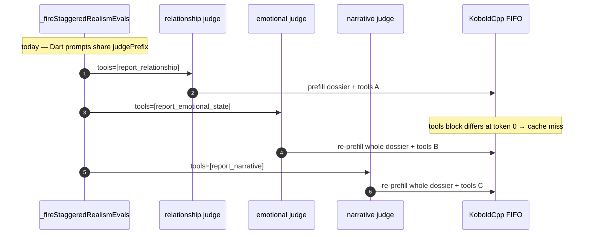
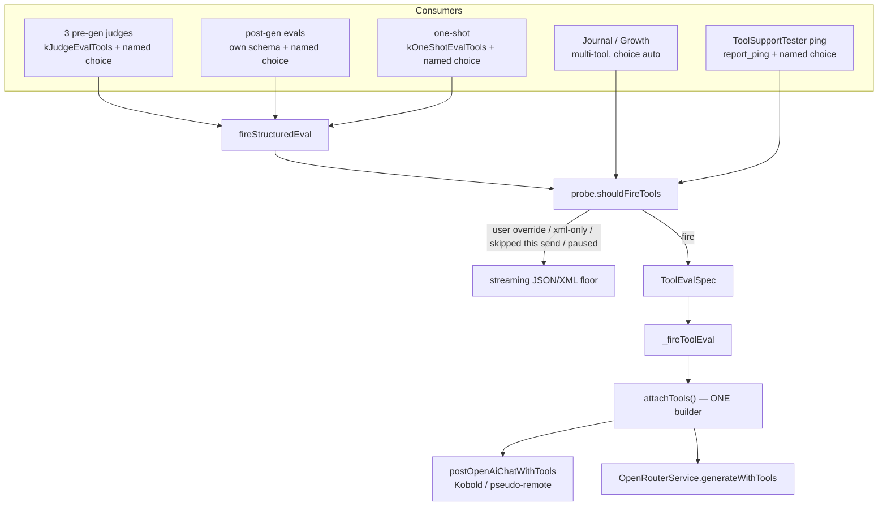

# Make tool calling actually work the way it should

**Author:** TBD
**Date:** 2026-08-27
**Status:** Draft (revised 2026-08-27 after design review)
**Branch:** Rawhide
**Audience:** an implementing agent (the maintainer cannot read Dart)

---

## Overview

The tools lane was built as a **reliability** upgrade: native function calls convert to the same flat JSON the Realism Engine has always parsed, so empty chips get rarer. It was never matched to the workload it now carries — three short pre-generation judges on a local KoboldCpp backend, already optimized around a shared prompt prefix, streaming, and no GBNF.

A Discord user (SAMF) observed that resetting the sidebar tool-calling pill to "not supported" makes those evals **noticeably faster**, and asked for a manual override to prefer the JSON floor even when tools are supported. That override is a legitimate safety valve and ships in this design. It is not the product. The product is: **when tools are used, they should be at least as fast as the JSON floor in the common local case (shared `tools` array so jinja prefix-cache hits), and more reliable, especially for the three local judges.** Residual: a chat template that folds `tool_choice` into that prefix can still miss the cache; that is called out, not promised away.

Live-code verification (2026-08-27) confirms the slowness is structural, not a wrong-parser bug. Successful tool calls still go through `realismToolCallToJson` → the unchanged parse/apply pipeline. The tools path loses on the **wire**: different per-judge `tools` arrays break Kobold's KV cache; `tool_choice: 'auto'` is the wrong contract for a forced one-function eval; the call is non-streaming with a chat-sized 4000-token budget and a 6-minute hang cap; an empty/aborted tools attempt does not brand the model, so the next eval pays tools **plus** JSON again.

This document specifies the contracts, file paths, tests (including how to prove them red), path-complete twins, and an incremental PR plan.

---

## Background & Motivation

### What shipped, and what it optimized for

Every structured eval (the 4 realism judges, one-shot, needs-impact, scene-time, posture, climax, pockets, fused reply-facts, expression reclassifier, cast detector) goes through one negotiation: `fireStructuredEval` in `lib/services/chat/pass_support.dart`. Tools first; a matching call is converted by `realismToolCallToJson` (`lib/services/chat/realism_tools.dart`) into the canonical flat-JSON text; backends that cannot speak tools fall back to the streaming JSON/XML floor.

The Journal (`journal_maintenance.dart` `_runExchange`) and Growth (`growth_service.dart` `_runExchange`) share the **same** `ToolTransportProbe` so a backend answers the capability question at most once per run. They consume the call list directly (`parseJournalToolCalls` / `parseGrowthToolCalls`), not via `callToText`. Capability branding of genuinely tool-less models is the `ToolSupportTester` ping's job (`lib/services/chat/tool_support_tester.dart`), which drives the sidebar pill.

Docs still sell tools as making evals **more reliable**, not faster (`docs/realism-engine.md`). That was honest when the lane was added. It is no longer acceptable as the user-visible cost.

### Live contracts (verified 2026-08-27, do not re-derive from memory)

| Surface | Live behaviour |
|---|---|
| `postOpenAiChatWithTools` (`lib/services/openai_chat_stream.dart:178`) | `stream: false`, `tool_choice: 'auto'`. Comment on the function says there is **no wall-clock timeout** on the HTTP post; the 6-minute cap is applied **above** it. |
| `OpenRouterService.generateWithTools` (`lib/services/open_router_service.dart:468`) | Same: `stream: false`, `tool_choice: 'auto'`. The two doors set this independently — they can (and currently do) only stay in sync by coincidence. |
| `KoboldService.generateWithTools` (`lib/services/kobold_service.dart:419`) | `_runSerialized` → `waitForIdle` + `postOpenAiChatWithTools`. Local is single-slot FIFO. That FIFO is what makes the shared `judgePrefix` worth anything. |
| `_fireToolEval` (`lib/services/chat/chat_service_wiring_evals.dart:541`) | Signature is `(String prompt, List tools)` — **no `toolChoice`**. `maxLength: 4000`, `temperature: 0.1`, `repeatPenalty: 1.15`, `reasoningEnabled: false`, `reasoningMaxTokens: 0`, `salvageReasoning: true`, `stopSequences: const []`, `.timeout(kEvalToolCallTimeout)` where `kEvalToolCallTimeout = 6 minutes` (`llm_eval_engine.dart:45`). `[EvalTraffic]` labels the call with `tools.first['function']['name']` (lines 550–553). |
| Scalar **text** evals (`LlmEvalEngine.fireLLMEval`) | Same 4000 / 0.1 / reasoning-off, but `repeatPenalty: kScalarEvalRepeatPenalty` (**1.0**), **streaming** via `generateStream`, hang cap `kEvalStreamChunkTimeout = 180s` **between chunks**. Overlay shows tokens live. |
| Three judges | `kRelationshipEvalTools` / `kEmotionalEvalTools` / `kNarrativeEvalTools` — **three different one-tool lists**. Fired from `evaluateRelationshipCall` / `evaluateEmotionalStateCall` / `evaluateNarrativeCall` (`realism_evals.calls.dart:88, 198, 367`). |
| Shared prefix | `RealismPromptBuilder.judgePrefix` is byte-identical. Dispatch in `_fireStaggeredRealismEvals` is relationship, then emotional delayed `_kEvalDispatchStagger` (50ms), then narrative delayed 2×. Pinned by `test/services/chat/realism_shared_prefix_test.dart`. **The test only asserts the Dart prompt string.** It never looks at the HTTP `tools` array. |
| One-shot Auto | `resolveOneShotMode` (`pass_support.dart:103`): fuse only on **remote + `ToolCallSupport.supported`**. Local never fuses (small models struggle with fused prompt length). SAMF's "realism is slower with tools" is therefore a **local** (or remote + one-shot Off) symptom. |
| Probe on empty | Null resp, empty 200, transport failure, cancel: **inconclusive**. Do not brand XML-only. Next eval tries tools again. This is how the pill fell off after Scene Guests / abort / visiting character creation — and how you pay tools **plus** JSON every round in that state. Journal and Growth duplicate this policy in their own `_runExchange` bodies. |
| Overlay | `fireStructuredEval` comment at `pass_support.dart:202`: "the tools lane doesn't stream tokens". It dumps the synthesized JSON on `onChunk` **once, at the end**. The web overlay (`ProcessingOverlay.tsx`) and desktop (`realism_processing_overlay.dart`) both render `realismEvalStreamTextClean`, so a non-streaming tools call looks frozen until it finishes. |
| Tests pinning `'auto'` | `test/services/open_router_tools_test.dart:158` and `:241`. Any edit of an **existing** test file needs maintainer `approved-test-change` (test-integrity.yml) — not just this one file. Changing `FireToolEval` to `ToolEvalSpec` is a compile break on every `(p, t)` closure (listed in §9). |
| Chargen | `character_gen_porch_life.dart` already calls `generateWithTools` with `maxLength: 512` and `porchLifeToolSchema`. It does **not** go through `_fireToolEval`. Leave its prose/chargen path alone except to pass a named `toolChoice` once the helper exists. |
| Remote think headroom | `OpenRouterService._chatPayload` (`open_router_service.dart:332`) already sends `params.maxLength + kMandatoryReasoningThinkHeadroomTokens` (**16000**, `reasoning_effort.dart:211`) when `salvageReasoning && reasoningCannotDisable(modelName)`. `_fireToolEval` already sets `salvageReasoning: true`. Today's Kimi tools eval is **4000+16000 on the wire**, not 4000. The local door (`openai_chat_stream.dart:90`) does **not** add that headroom: `max_tokens: params.maxLength`. |
| Mandatory-reasoning retry | `OpenRouterService.generateWithTools` on a cannot-disable 400 retries `return await generateWithTools(params, tools);` (`open_router_service.dart:505`) — **positional only**. New named args (`toolChoice`, `onChunk`) are dropped unless the recursive call forwards them. |
| `FireToolEval` type | `(String prompt, List<Map<String, dynamic>> tools)` at every production site: `pass_support.dart:180`, `journal_maintenance.dart`, `growth_service.dart`, `tool_support_tester.dart:47`, `llm_eval_engine.dart:259`, `time_service.dart`, `expression_classifier.dart`, `cast_detector.dart`, `realism_evals.dart`. Judges never call `generateWithTools` themselves; they go `_fireEval` → `fireStructuredEval` → that callback → `_fireToolEval`. |
| User-send entry | 1:1 and group user turns both enter `sendMessage` (`chat_service_send.dart:33`). Later group speakers call `_evaluateRealismForUpcomingSpeaker` from `_generateResponse` without going through `sendMessage` again. Continue is `continueGeneration`; regen is `regenerateLastMessage`. The three Chaos-seed sites (`chat_service_chat_entry.dart`, `chat_service_session_manage.dart`, `chat_service_group_entry.dart`) are conversation **begin**, not user-send. |
| File caps | `porch_life_tab.dart` is **exactly 500 lines**. `realism_tools.dart` is 553, `openai_chat_stream.dart` 346, `open_router_service.dart` 795, `chat_service_wiring_evals.dart` 659, `settings_facade.dart` 552, `pass_support.dart` 246, `realism_settings.dart` 491, `chat_facade.dart` 756, `PorchLifeSettings.tsx` 492. New Dart must not grow a file to 1000; prefer not growing anything already over 500. `pass_support.dart` stays under 500 — extract the probe policy if the sketched methods do not fit. |

### Why tools are slower on a local backend (the actual physics)

A realism judge prompt is short **output** and long **input**: dossier + standing + preferences + ambitions + a 4-message window, opened by `judgePrefix`. Prefill of that dossier is the expensive part. Decode of a 80–150 token JSON object is cheap.

KoboldCpp / llama.cpp jinja templates inject the `tools` array **near the start** of the rendered prompt (`<tools>` / system). We do not control that template. Three judges with three different `tools` arrays therefore tokenize three **different prefixes**, even when the Dart prompt strings share `judgePrefix`. Call two and three cannot fast-forward through call one's KV cache. They re-prefill the whole dossier. That is 3× the cost the stagger was built to avoid.

`tool_choice: 'auto'` makes it worse: the model is allowed to write prose, think about whether to call, or emit both. These evals always want **exactly one named function**. `'auto'` is the chat-agent default. It is the wrong default here.

**Residual (not in this repo's jinja):** some stacks apply a grammar / append a `functions.{name}:` suffix *after* the messages (prefix cache still hits). Some templates mention the chosen function **near** the tools block (prefix cache still misses). This repo does not contain Kobold's jinja, so that is unverified. Shared `tools` + named choice is the controllable fix for the injection we *do* know about. It is necessary, not automatically sufficient, if a family folds `tool_choice` into the prefix. See the poke script.

The 4000-token budget is chat-sized. A `report_relationship` object is tens of tokens. If constrained decoding does not stop promptly after the call, or a mandatory-reasoning model parks tokens in the think channel, the non-streaming call sits silent until `kEvalToolCallTimeout` (6 minutes) or until the server finally returns. The JSON path would have been streaming into the overlay the whole time, and its hang detector is 180s **between chunks**, not 6 minutes of darkness.

Finally, an inconclusive tools miss (Kobold `/api/extra/abort` returns HTTP 200, zero tokens, no `tool_calls`) falls through to JSON **and leaves the probe untested**. The next judge, and the next turn, try tools again. In the Scene Guest / abort state you pay tools + JSON on every eval of every turn. SAMF resetting the pill to "not supported" is them discovering `markXmlOnly` by hand: skip the tools attempt entirely. That is faster because it is **one** generation, not two, and because that one generation is the streaming JSON path whose prefix cache actually works.



### Why "just hide the pill" is not the design

A toggle that forces `markXmlOnly` would make SAMF happy this week and lie about capability forever. The next model switch, the next ToolSupportTester ping, and one-shot Auto (which keys on `ToolCallSupport.supported`) would all be wrong. The pill would say "not supported" about a model that just called `report_ping` successfully.

The override still ships. It must say **"supported, using JSON"** — preference, not capability.

---

## Goals & Non-Goals

### Goals

1. **Speed (local, common case).** On families whose jinja injects the `tools` array at the start of the system message (Qwen / llama.cpp default), wall-clock of the three pre-generation judges with tools should not exceed the same three judges on the JSON floor, same model, same prompt. Ideally faster: constrained decoding should emit fewer junk tokens. This is **not** a universal local guarantee: if a template folds `tool_choice` into that prefix, the cache can still miss with identical `tools` arrays. Target in CI is payload identity (identical `tools`, named `tool_choice`), plus a maintainer poke that diffs **rendered first-N tokens** if wall-clock is still ~3×. `[EvalTraffic]` labels must be the three different `report_*` names (never `tools.first` after the shared list).
2. **Reliability.** Tools remain the preferred way to get clean structured output when the model speaks them. Empty chips stay rarer than JSON. Forced `tool_choice` is the reliability half of this.
3. **No double generation as a lifestyle.** A failed/empty/aborted tools attempt must not routinely cost a tools call PLUS a JSON call on every remaining eval of the turn, and must not retry forever across turns without a ping. Probe memory stays honest: empty/abort still does **not** brand the model tool-less.
4. **KV cache on the wire.** The shared `judgePrefix` optimization must hold on the **HTTP payload the server templates**, not just in Dart strings.
5. **Correct `tool_choice`.** Scalar evals always want exactly one named function. Journal/Growth keep `'auto'` (zero calls is a valid "nothing to journal / no growth").
6. **Eval-sized budgets.** Align max tokens, repeat penalty, and hang detection with the scalar text path (or better).
7. **User override.** Manual "prefer JSON even if supported." Desktop **and** web. Default: use tools when supported. Pill distinguishes skipped vs not-supported.
8. **Overlay honesty.** Users see *something* moving on the tools path from the first request, not a frozen overlay until a 6-minute cap. Live token streaming of tool-call arguments is a follow-up PR; PR-1 at least emits a start-of-call status chunk.
9. **Parity.** 1:1 vs group, Continue vs regen, Journal vs Growth twins, desktop vs web/relay. Path-complete matrices below.
10. **Hygiene.** No new sidecars. No god-file growth. Dart files stay under 500 where we touch them; nothing may reach 1000. Barrels. `AppColors` for any new UI. Do not edit `pubspec.yaml` version.

### Non-Goals

- Making local backends fuse one-shot Auto. Local stays multi-call. Remote Auto fusion must not regress.
- Reintroducing GBNF on the JSON floor. CLAUDE.md known gotcha: GBNF produced empty evals. Tools constrained decoding is the **server's** grammar for function calls; we do not add a client-side grammar on either lane.
- Unifying Journal/Growth onto `fireStructuredEval`. They consume call lists, not `callToText`. Share the **probe policy helper**, not the consume shape.
- Inferring `toolChoice` from `tools.first` as a "temporary" bridge between PR 1 and PR 2. That is a race and a footgun.
- Changing what a successful tool call **means**. Conversion → parse → apply stays byte-identical. This work is transport, not simulation.
- The Stoop, Cloud Sync, or any schema migration.
- A per-chat tools override. Global (Porch Life) + the live pill is enough. Individual chats do not need a third switch.
- Rewriting llama.cpp / Kobold jinja to inject tools at the end. We do not control that template. Shared `tools` list is the controllable fix.
- Making tools faster than JSON on a remote provider that already fuses via one-shot Auto. Do not touch that path except to honour the override (Auto must not fuse when the user asked for JSON).

---

## Key Decisions

1. **Force named `tool_choice` on scalar evals; keep `'auto'` on Journal/Growth.** One builder so Kobold and OpenRouter cannot drift. Rationale: these evals always want exactly one function; Journal/Growth may honestly call zero tools ("nothing worth journaling"). Chargen (`set_porch_life`) should also pass the named choice once the helper exists — it already wants one function. **Named choice is an argument on every in-flight call (`ToolEvalSpec.toolChoice`), in the same PR that first sends it through `fireStructuredEval`.** Inferring the name from `tools.first` is forbidden: it only works while each judge still sends a one-tool list, and it is always `report_relationship` the moment PR 2 concatenates `kJudgeEvalTools`. A ChatService field / zone "current toolChoice" races the 50ms stagger. Do not share the list until the spec is on the wire.
2. **Send the same `tools` list on all three prefix-sharing judges; select the function via `tool_choice`.** `kJudgeEvalTools = relationship + emotional + narrative`. Rationale: we cannot move the jinja tools block; we can make it identical. One-shot, post-gen (needs/climax/pockets/posture/time), ping, Journal, Growth keep their own lists — they do not share `judgePrefix`. Label `[EvalTraffic]` from `spec.toolChoice`, never `tools.first`. Residual: some templates may still fold the chosen name into the prefix — poke, don't promise.
3. **Eval-sized `GenerationParams.maxLength` on scalar tool evals is 512. Do not special-case 4000 inside `_fireToolEval` for mandatory-reasoning.** Keep `salvageReasoning: true`. The **remote** door already sends `max_tokens = params.maxLength + kMandatoryReasoningThinkHeadroomTokens` (16000) when `salvageReasoning && reasoningCannotDisable(modelName)` — so a Kimi tools eval is 512+16000 on the wire (2026-08-15). The **local** door must **not** copy that helper onto a GGUF path: `reasoningCannotDisable('/models/foo.gguf')` is almost always false, and local hard-on templates already get `thinking_budget: 0` via `thinkingBudgetClampForThinkOff` / `kHardOnThinkingModels`. Local HTTP `max_tokens` is `params.maxLength` (512 for scalar). A local-heretic truncation after budget 0 is a follow-up, not PR 1. Journal/Growth keep `maxLength` 4000 / repeat 1.15; scalar repeat penalty is 1.0. Freeze 512 for PR 1–4.
4. **Empty/abort stays inconclusive (do not brand XML-only). After an inconclusive miss, skip tools for the rest of *this* `sendMessage`; `endUserSend(id)` counts consecutive **sends** (skip nonempty → `n++`, else `n = 0`; pause if `n >= 2`) then clears skip.** Regen of a finished turn retries tools. Three empty judges in one send must **not** pause. `noteInconclusive` only sets skip. `markSupported` clears consecutive/skip **before** the early return and does **not** unpause. Only `reset` / pill tap unpause, and `reset` must actually remove pause (`|` not `||`). `beginUserSend` / `endUserSend` wrap the turn body of `sendMessage` in a **new** try/finally — not the settle-wait `finally` at line 98.
5. **Override is a preference bit, not a capability lie.** `RealismSettings.preferTextEvals` (default false). Persist that name; UI switch ON = use tools = `!preferTextEvals`. Never store a `nativeToolCalling` pref unless the bit matches the switch. `ToolTransportProbe` still reports `supported`. Pill copy: "supported — using JSON". `resolveOneShotMode` treats override as "tools not in use". `shouldFireTools` reads storage through a **live** callback, not a frozen ctor bool.
6. **Do not stream tool calls in the first PR.** Emit a start-of-call overlay chunk from **`fireStructuredEval`** (existing `debugLabel` + `onChunk`) so Journal/Growth (same `_fireToolEval` door) stay silent. Streaming SSE `delta.tool_calls[].function.arguments` is PR 5.
7. **One payload helper, two doors, plus a `ToolChoiceStyleProbe` sibling of `SystemRoleProbe`.** New `lib/services/openai_tool_payload.dart` (`attachTools` + `attachToolsWithStyleRetry`). The helper returns `http.Response` and **never** nulls an unrelated 400 — the OpenRouter door must still see `_isMandatoryReasoningRejection`. New `lib/services/tool_choice_style_probe.dart` — injectable default singleton. `open_router_service.dart` line delta **≤ 0 net**; the style-retry loop does not live in that 795-line file, but 429/Kimi/parse stay in the door. The recursive retry **must forward** `toolChoice` / `onChunk`.
8. **`porch_life_tab.dart` is 500 lines today.** Extract the closing-note `Container` (lines 472–496, ~30 lines — enough for one FeatureRow) *or* the Engine card. Prefer a one-row **"Model transport"** group so "Native tool calling" is not filed under "feelings about what you do."

---

## Proposed Design

### Architecture (after)



### 1. One `tool_choice` builder

New file `lib/services/openai_tool_payload.dart` (well under 500; add to no barrel that would self-import — `lib/services/` files import each other directly, which is the documented exemption).

```dart
/// OpenAI `tool_choice` value.
///
/// [functionName] non-null → `{"type":"function","function":{"name": ...}}`
/// (scalar evals, ping, chargen). Null → `'auto'` (Journal/Growth, where
/// zero calls is a valid honest empty).
Object toolChoiceValue({String? functionName}) {
  if (functionName == null || functionName.isEmpty) return 'auto';
  return {
    'type': 'function',
    'function': {'name': functionName},
  };
}

Map<String, dynamic> attachTools(
  Map<String, dynamic> payload, {
  required List<Map<String, dynamic>> tools,
  String? toolChoice,
  bool stream = false,
}) {
  payload['tools'] = tools;
  payload['tool_choice'] = toolChoiceValue(functionName: toolChoice);
  payload['stream'] = stream;
  return payload;
}
```

Both doors replace the two-line `..['tools'] = tools; ..['tool_choice'] = 'auto'` with `attachTools(...)`. They do **not** own the 400-retry loop (open_router_service.dart must net ≤ 0 lines).

**Fallback if a server 400s the named object.** Some older OpenAI-compatible hosts only accept `'auto' | 'none' | 'required'`. Do **not** brand that as XML-only (the model may still speak tools). Today a 400 returns **null** (`openai_chat_stream.dart:220`, `open_router_service.dart:496`), which `fireStructuredEval` treats as empty/inconclusive — **not** `markXmlOnly` — so a `tool_choice` 400 retries tools forever. The style probe is what remembers the 400.

The two HTTP doors do not have `ToolTransportProbe`. Do not stuff a static map into `openai_tool_payload.dart` (shared state flakes tests — this is why `SystemRoleProbe` is an injectable default singleton, `system_role_probe.dart:161-171`).

New tiny `lib/services/tool_choice_style_probe.dart`, modeled on `SystemRoleProbe`:

```dart
enum ToolChoiceStyle { named, required, auto }

class ToolChoiceStyleProbe {
  static final instance = ToolChoiceStyleProbe(); // tests inject their own
  final Map<String, ToolChoiceStyle> _style = {};

  ToolChoiceStyle styleFor(String identity) =>
      _style[identity] ?? ToolChoiceStyle.named;

  void remember(String identity, ToolChoiceStyle style) =>
      _style[identity] = style;

  void reset(String identity) => _style.remove(identity);
}
```

`attachToolsWithStyleRetry` lives next to `attachTools` in `openai_tool_payload.dart`. Both doors call **that** helper (not a copy of the loop). It must **not** translate HTTP into `null`. If it owns the POST and returns null on an unrelated 400, the OpenRouter door never sees the body of `_isMandatoryReasoningRejection` (`reasoning` + `mandatory`/`cannot be disabled`/`exclude=true` at `open_router_service.dart:41-47`) and the 2026-08-15 Kimi remember-and-retry dies.

Shape:

```dart
Future<http.Response> attachToolsWithStyleRetry({
  required String identity,
  required List<Map<String, dynamic>> tools,
  String? toolChoice, // null = Journal/Growth auto; do not step style
  required Map<String, dynamic> basePayload,
  required Future<http.Response> Function(Map<String, dynamic> payload) post,
}) async { /* see steps */ }
```

1. Start from `styleFor(id)` (default `named`). Attach `tools` + `tool_choice` for that style onto a copy of `basePayload`. `post(payload)`.
2. If status is **400** AND `toolChoice` is non-null AND body matches `RegExp(r'tool[_ ]?choice', caseSensitive: false)`:
   - `named` → remember `required`, `post` again this call;
   - `required` → remember `auto`, `post` again this call;
   - `auto` → return **that Response** (door decides null vs throw).
3. **Any other status, including an unrelated 400** (mandatory-reasoning, tools unsupported, bad schema) → return **that Response immediately**. Do not step the style. Do not return null.
4. Never throw 429/5xx from the helper. Never `markXmlOnly`. Never `parseOpenAiToolResponse`.

The OpenRouter door still: 429/5xx → `LlmToolTransportException`; `_isMandatoryReasoningRejection` → `rememberMandatoryReasoning` + recursive `generateWithTools(params, tools, toolChoice: toolChoice, onChunk: onChunk)`; `finish_reason=length` log; `parseOpenAiToolResponse`. The Kobold door still: 429/5xx throw; non-200 → null as today.

Pin (new `open_router_tools_retry_test.dart`): first 400 body is the Nano-GPT mandatory-reasoning sentence (**no** `tool_choice` in it); `kMandatoryReasoningModels` contains the model and a **second** POST happens; style stays `named`. A `tool_choice` 400 still steps named → required on both doors.

Identity key is the same shape as `_evalBackendIdentity`. Wire `ToolChoiceStyleProbe.reset(id)` from `_onBackendIdentityMaybeChanged`.

`generateWithTools` gains optional named params so Journal/Growth callers stay source-compatible:

```dart
// lib/services/llm_service.dart
Future<LlmToolResponse?> generateWithTools(
  GenerationParams params,
  List<Map<String, dynamic>> tools, {
  String? toolChoice,
  void Function(String chunk)? onChunk, // unused until the streaming PR
  bool Function()? stillWantTools, // after FIFO; skip/pause/xml-only, NOT prefer-text
}) async => null;
```

Production overrides that must grow the signature (optional named, so existing positional call sites compile):

- `lib/services/kobold_service.dart` `generateWithTools`
- `lib/services/open_router_service.dart` `generateWithTools`

Test fakes that **override** `generateWithTools` (must be updated or they will not be valid overrides):

- `test/services/chargen/porch_life_identity_test.dart`
- `test/services/chat/expression_classifier_test.dart`

Every other `extends LLMService` fake inherits the base default and is fine.

`postOpenAiChatWithTools` gets the same optional `toolChoice` / `stream` args.

### 2. Shared tools list for the three judges (the KV-cache fix)

In `lib/services/chat/realism_tools.dart` (553 lines — add only this, do not grow further):

```dart
/// Wire list for the three prefix-sharing pre-generation judges.
///
/// llama.cpp / Kobold jinja injects `tools` near the start of the rendered
/// prompt. Three different one-tool lists tokenize three different prefixes
/// and silently defeat `judgePrefix` + `_fireStaggeredRealismEvals`. One
/// identical list + a named `tool_choice` keeps the templated prefix
/// cacheable; `realismToolCallToJson` still filters by the expected name.
final List<Map<String, dynamic>> kJudgeEvalTools = [
  ...kRelationshipEvalTools,
  ...kEmotionalEvalTools,
  ...kNarrativeEvalTools,
];
```

Call-site change — only these three (trust-repair remaining evals reuse the same methods, so they pick it up):

| File | Today | After |
|---|---|---|
| `realism_evals.calls.dart` `evaluateRelationshipCall` | `tools: kRelationshipEvalTools` | `tools: kJudgeEvalTools` (still `toolName: kRelationshipTool`) |
| `evaluateEmotionalStateCall` | `kEmotionalEvalTools` | `kJudgeEvalTools` + `kEmotionalTool` |
| `evaluateNarrativeCall` | `kNarrativeEvalTools` | `kJudgeEvalTools` + `kNarrativeTool` |

**Gate:** this list change is **PR 2**. It is not allowed to land until PR 1 has put `toolChoice` on `ToolEvalSpec` and `_fireEval` already passes `toolName` as `spec.toolChoice`. Inferring from `tools.first` is a footgun the moment the list is concatenated (every judge would name `report_relationship`).

`_fireEval` (`realism_evals.support.dart:159`) must pass `toolName` through as `toolChoice` on the tools fire. That is the selector. That threading is **PR 1** (it works with today's one-tool lists too — named choice instead of `'auto'`).

If the model ignores `tool_choice` and calls a sibling judge's function, `realismToolCallToJson(expectedName, calls)` returns null (it already skips unknown names). Treat that as a miss for **this** eval: salvage prose if any, else fall back to JSON. Do **not** apply the wrong schema. Do **not** brand XML-only — the model *did* speak tools.

One-shot stays `kOneShotEvalTools` / `kOneShotTool`. Post-gen evals stay on their own one-tool lists. They do not share `judgePrefix`; concatenating every eval tool in the app into one mega-list would only make every prompt larger.

**`[EvalTraffic]` labels.** `_fireToolEval` today labels with `tools.first['function']['name']` (`chat_service_wiring_evals.dart:550-553`). After `kJudgeEvalTools`, that is always `report_relationship`. Label from `spec.toolChoice` (fall back to `debugLabel` / `'tool'`). Same PR that concatenates the list **or** PR 1 (ToolEvalSpec has the name even with one-tool lists — prefer PR 1 so the poke script is readable immediately). Guard in `judge_tools_wire_test.dart`: three judge fires produce three different traffic labels.

### 3. Eval-sized budgets and scalar sampler parity

`_fireToolEval` today hardcodes 4000 / 1.15 for everyone. Split **`GenerationParams.maxLength`** by what is being asked — this is **not** the HTTP `max_tokens` on a mandatory-reasoning remote model.

| Caller | `GenerationParams.maxLength` | HTTP `max_tokens` (remote, cannot-disable) | HTTP `max_tokens` (local) | `repeatPenalty` | `toolChoice` |
|---|---|---|---|---|---|
| Scalar `report_*` evals | `kScalarToolMaxTokens = 512` | **512 + 16000** when `salvageReasoning && reasoningCannotDisable(modelName)` (existing) | **512** (`params.maxLength`; no 16000) | `kScalarEvalRepeatPenalty` (1.0) | the `report_*` name |
| `report_ping` | 64 | 64, or 64+16000 if cannot-disable | **64** | 1.0 | `'report_ping'` |
| Journal / Growth | 4000 | 4000+16000 if cannot-disable | **4000** | 1.15 | `null` → `'auto'` |

Do **not** special-case 4000 inside `_fireToolEval` when `reasoningCannotDisable`. Remote tools already add `kMandatoryReasoningThinkHeadroomTokens` (16000) when `salvageReasoning && reasoningCannotDisable` (`open_router_service.dart:332`). Keep `salvageReasoning: true`. Pin the **HTTP** `max_tokens` (loopback), not `GenerationParams.maxLength`. The salvage test already does this for `generateStream`; add the tools door (512+16000 on cannot-disable remote; 512 on can-disable remote).

**Local door.** `openai_chat_stream.dart:90` sets `'max_tokens': params.maxLength`. That stays. Do **not** add 16000 via `reasoningCannotDisable(thinkingModelKey)`: a GGUF path is not a Kimi model id, so the helper is almost always false, and a filename that happens to match would inflate `max_tokens` while `thinking_budget: 0` (`thinkingBudgetClampForThinkOff` / `kHardOnThinkingModels`, already wired at `openai_chat_stream.dart:148`) is the local suppress. Pin HTTP `max_tokens == 512` for a local can-disable GGUF. If a local heretic poke still truncates with budget 0, that is a follow-up using `kHardOnThinkingModels`, not a copy of the remote helper. SAMF's Qwen case is 512 and stops.

`kScalarToolMaxTokens = 512` is frozen for PR 1–4. A relationship object is tens of tokens; 512 is 5–10× headroom for a reason string. Reply-facts `inventory_ops` can be chunkier — if `finish_reason=length` shows up on pockets in the poke, raise **that** caller to 1024, not the judges.

Hang cap: scalar tools deadline is `kEvalStreamChunkTimeout` (180s), the same "this backend is stuck" number the text lane uses. Journal/Growth keep `kEvalToolCallTimeout` (6 minutes) because a large window can legitimately prefill slowly.

Reasoning-off stays exactly as today (`reasoningEnabled: false`, `reasoningMaxTokens: 0`, `salvageReasoning: true`). That block is load-bearing for Kimi / heretic templates; do not "simplify" it.

### 4. `ToolEvalSpec` — stop growing the callback signature (this is PR 1, not PR 2)

`fireStructuredEval`'s `fireToolEval` callback is currently `(String prompt, List tools)`. Scalar evals never call `generateWithTools` themselves. They go `evaluateRelationshipCall` → `_fireEval` → `fireStructuredEval` → `fireToolEval(prompt, tools)` → `ChatService._fireToolEval(prompt, tools)`. PR 1 cannot claim named choice on the judges unless this callback carries `toolChoice` **in the same PR**. Inferring from `tools.first` is forbidden (see Key Decision 1). The three judges already run under `Future.wait` with a 50ms stagger; a ChatService field / zone "current toolChoice" races.

We now need `toolChoice`, `maxLength`, `repeatPenalty`, and later `onChunk` for streaming. Optional-named explosion is how this area got messy. One object:

```dart
// in pass_support.dart (246 lines today; this fits)
class ToolEvalSpec {
  final String prompt;
  final List<Map<String, dynamic>> tools;
  final String? toolChoice;      // null = auto
  final int maxLength;
  final double repeatPenalty;
  final void Function(String chunk)? onChunk;

  const ToolEvalSpec({
    required this.prompt,
    required this.tools,
    this.toolChoice,
    this.maxLength = 4000,
    this.repeatPenalty = 1.15,
    this.onChunk,
  });
}

typedef FireToolEval = Future<LlmToolResponse?> Function(ToolEvalSpec spec);
```

`fireStructuredEval` builds the spec from the eval's `toolName` + the (possibly shared) `tools` list + scalar defaults. `_fireEval` passes `toolName` as `spec.toolChoice` in **this same PR**.

Journal `_runExchange` and Growth `_runExchange` build a spec with `toolChoice: null`, 4000, 1.15.

`ToolSupportTester` builds a spec with `toolChoice: 'report_ping'`, 64, 1.0.

**Every production typedef / closure that must change in PR 1** (mechanical `(p, t)` → `(spec)`):

| File | Site |
|---|---|
| `lib/services/chat/pass_support.dart` | `fireStructuredEval` parameter |
| `lib/services/chat/realism_evals.dart` | field `fireToolEval` |
| `lib/services/chat/realism_evals.support.dart` | `_fireEval` → `fireToolEval(spec)` |
| `lib/services/chat/journal_maintenance.dart` | field + `_runExchange` |
| `lib/services/chat/growth_service.dart` | field + `_runExchange` |
| `lib/services/chat/tool_support_tester.dart` | field + `test()` |
| `lib/services/chat/llm_eval_engine.dart` | field + needs-impact `fireStructuredEval` |
| `lib/services/chat/time_service.dart` | field |
| `lib/services/chat/expression_classifier.dart` | field |
| `lib/services/chat/cast_detector.dart` | field |
| `lib/services/chat/chat_service_wiring_evals.dart` | `_fireToolEval(ToolEvalSpec)` + every `fireToolEval: _fireToolEval` |
| `lib/services/chat/chat_service_wiring_memory.dart` | Journal + Growth + one more `fireToolEval: _fireToolEval` |
| `lib/services/chat/chat_service_wiring_realism.dart` | two `fireToolEval: _fireToolEval` |
| `lib/services/chat/chat_service_realism_evals.dart` | one `fireToolEval: _fireToolEval` |

Do **not** introduce a third private method on ChatService to wrap it — `_fireToolEval` already is that method; change it in place. Test closures: see §9 (all need `approved-test-change` if those files are edited).

`preferTextEvals` is read through a **live** callback (`getPreferTextEvals: () => _storageService.realismSettings.preferTextEvals`), the same shape as `standaloneClockEnabled`. Do not capture a bool in a ctor and freeze it for the session.

### 5. Probe policy: honest, and not 2×

Keep the Scene Guest rule: empty 200 / null / transport failure / cancel is **not** `markXmlOnly`. Genuinely tool-less models still get branded by (a) the ping (prose instead of a call) or (b) a non-transport rejection.

Add two memories on `ToolTransportProbe`. Live `markSupported` early-returns when already `true` (`pass_support.dart:138-141`). **Clears of skip and consecutive happen before that return; pause is only `reset`.** Otherwise: identity already `supported` (the common case after a ping) + abort → skip set; send ends skipped → `consecutive = 1`; next send succeeds → `endUserSend` sees skip empty → consecutive is 0. If consecutive were incremented inside `noteInconclusive` instead, one aborting send would pause.

```dart
final Set<String> _skipThisSend = {};
final Map<String, int> _consecutiveInconclusive = {};
final Set<String> _pausedUntilPing = {};

bool shouldFireTools(String id, {required bool preferTextEvals}) {
  if (preferTextEvals) return false;
  return shouldPostAfterIdle(id);
}

/// FIFO re-check / ping door. Skip, pause, xml-only — **not** prefer-text.
/// `_fireToolEval` is also ToolSupportTester's ping. Passing live
/// preferTextEvals here makes a pill tap with Native tool calling off
/// never POST `report_ping`, so the pill can never show
/// "supported — using JSON".
bool shouldPostAfterIdle(String id) {
  if (isXmlOnly(id)) return false;
  if (_pausedUntilPing.contains(id)) return false;
  if (_skipThisSend.contains(id)) return false;
  return true;
}

void beginUserSend() => _skipThisSend.clear();

/// Count consecutive empty SENDS, then clear skip so regen retries tools.
/// [id] is `_evalBackendIdentity` for this send.
void endUserSend(String id) {
  if (_skipThisSend.contains(id)) {
    final n = (_consecutiveInconclusive[id] ?? 0) + 1;
    _consecutiveInconclusive[id] = n;
    if (n >= 2) {
      _pausedUntilPing.add(id);
      notifyListeners();
    }
  } else {
    _consecutiveInconclusive[id] = 0;
  }
  _skipThisSend.clear();
}

/// Intra-send skip only. Do NOT increment consecutive here — three
/// empty judges in one send must not pause.
void noteInconclusive(String id) {
  final wasEmpty = _skipThisSend.isEmpty;
  _skipThisSend.add(id);
  if (wasEmpty) notifyListeners();
}

void markSupported(String id) {
  _consecutiveInconclusive[id] = 0;
  _skipThisSend.remove(id);
  // Pause is NOT cleared here. Only reset() / pill tap unpauses.
  if (_verdicts[id] == true) return;
  _verdicts[id] = true;
  notifyListeners();
}

void reset(String id) {
  // `|` not `||`: a supported identity's pill tap must still drop pause.
  final changed = _verdicts.remove(id) != null
      | _skipThisSend.remove(id)
      | _pausedUntilPing.remove(id)
      | (_consecutiveInconclusive.remove(id) != null);
  if (changed) notifyListeners();
}
```

`endUserSend` increments consecutive iff skip is still nonempty for `id` at send completion ("send ended still skipped"). A later `markSupported` in the same send clears skip, so a recovered send does **not** count toward pause. Then skip is cleared for regen.

**`beginUserSend` / `endUserSend` have exactly one call site:** `sendMessage` (`chat_service_send.dart`). `sendMessage` has **no** function-level try/finally today. The only `finally` (`chat_service_send.dart:98`) is the settle-wait `sendGate` and runs **before** slash-command / observer / pre-gen. Do **not** hang `endUserSend` on that `finally` — skip would clear before the send.

After proceed-guards (slash handled, observer `sendDirectorNote` returned):

```dart
_toolProbe.beginUserSend();
try {
  // rest of the turn: photo caption, pre-gen, generate, post-gen
} finally {
  _toolProbe.endUserSend(_evalBackendIdentity);
}
```

A rejected tap never reaches this. Early returns inside the turn (`_realismEvalCancelled` at :430, backend-down at :449, photo `stillHere` at :257) still hit `endUserSend`.

Do **not** put begin/end in the Chaos-seed conversation-begin files. Do **not** put them in `_evaluateRealismForUpcomingSpeaker`. Continue and regen are **non-callers**.

**AFK / `/speak` / Scene Guest mint** never call begin/end. Skip from **their** `noteInconclusive` lasts until the next user `beginUserSend`. Skip from the **user** send does **not** last — `endUserSend` cleared it, which is why regen retries tools. Do not write "leftover skip from the user send applies until the next sendMessage."

**Pause-until-ping** (threshold **2 sends**, frozen): counted only in `endUserSend`. Three empty judges in one send → paused is **false**. Two sends that each ended skipped → paused is **true**. Pill copy: "paused this run — tap to retry". `test(force: true)` calls `reset` first; `reset` must actually drop pause so the ping can run. `markSupported` does **not** unpause.

**Pins:** `supported` → inconclusive → successful tools fire → consecutive is 0. Judges succeeded with tools + later post-gen empty miss + regen → regen still attempts tools. `supported` + paused → `reset` → `isPausedUntilPing` is false and `supportFor` is untested, in one call. Three empty judges in one `endUserSend` → paused false.

**Concurrent staggered judges — re-check after FIFO, not in `chat_service_realism_evals.dart`.** All three judges call `shouldFireTools` at the **start** of `fireStructuredEval` long before judge 1's HTTP returns (local prefill is seconds, not 50ms). `_fireToolEval` is invoked synchronously from `fireStructuredEval`; a re-check "immediately before `_fireToolEval`" is the same moment and a no-op. The FIFO wait is **inside** `KoboldService.generateWithTools` → `_runSerialized` → `waitForIdle` (`kobold_service.dart:425, 455`). `chat_service_realism_evals.dart` does not call `_fireToolEval` (stagger goes `evaluate*Call` → `_fireEval` → `fireStructuredEval`).

Keep `shouldFireTools(..., preferTextEvals: live)` at the start of `fireStructuredEval` / Journal `_runExchange` (covers prefer-text and a miss that finishes in <50ms). Those callers never reach `_fireToolEval` when prefer-text is on.

Add `stillWantTools` on `generateWithTools`. **`_fireToolEval` passes `() => _toolProbe.shouldPostAfterIdle(_evalBackendIdentity)` — skip / pause / xml-only only. Never the live `preferTextEvals`.** After `waitForIdle`, if `stillWantTools` is false, return `null` without POST (JSON fallback for evals; ping is not in that path because `reset` already dropped pause/skip). Do **not** put this in `chat_service_realism_evals.dart`. OpenRouter is not FIFO; it does not need the callback. Do not serialize the three judges in Dart.

Pin: `preferTextEvals == true` + `test(force: true)` still POSTs `report_ping` and can `markSupported`. Proven-red: pass live `preferTextEvals` into `stillWantTools` → ping records no request.

**Twins.** Journal and Growth do **not** go through `fireStructuredEval`. They are wired in `chat_service_wiring_memory.dart` (must grow the `getPreferTextEvals` / spec callback there). `_runExchange` currently branches on `!probe.isXmlOnly` then fires tools. Replace that with `shouldFireTools`. Exact outcomes — **do not** `noteInconclusive` on every "no usable ops":

| Outcome | What to do |
|---|---|
| Honest empty: `resp.calls.isNotEmpty` but parsed ops empty | return `[]` / `(const [], null)`. Do **not** skip. Do **not** brand. Do **not** fall through to XML. |
| Prose, no tags | `markXmlOnly` (keep). Then XML this round. |
| Empty 200 / null / transport failure | `noteInconclusive` then XML this round. Do not brand. |
| Real tool calls that parse | `markSupported` (clears consecutive **before** early return) and apply. |

Proven-red: treat honest-empty as `noteInconclusive` and the new assertion fails.

`fireStructuredEval` currently does **not** brand on prose salvage (tester is the oracle, `pass_support_test.dart:97`). Do not "unify" Journal branding onto that in the wrong direction.

### 6. User override (the safety valve)

**Storage.** `RealismSettings.preferTextEvals` (bool, default **false**). Pref key `k('prefer_text_evals')` via the existing `SettingsBase.k` beta prefix. Load/save next to `oneShotMode` in `lib/services/storage/settings/realism_settings.dart` (491 lines — one field fits). Forwarding getter on `StorageService` like the other realism flags.

This is a **global** default, like one-shot. It is not per-chat. It is not a capability bit.

**Who honours it.** `fireStructuredEval` and both `_runExchange`s read it via `shouldFireTools(..., preferTextEvals: getPreferTextEvals())`. The callback is **live** (`() => _storageService.realismSettings.preferTextEvals`), the same as `standaloneClockEnabled` — a Porch Life flip takes effect on the next eval without a ChatService setter. Do not add a frozen ctor bool. Wire the callback in `chat_service_wiring_evals.dart` **and** `chat_service_wiring_memory.dart` (Journal/Growth).

**One-shot.** `resolveOneShotMode` must grow a `preferTextEvals` argument (default false, so existing tests keep compiling if we add it as optional named — **but** the production getter `_oneShotActive` in `chat_service_accessors.dart:159` must pass it). When prefer-text is on, Auto (and the call-mode Off-upgrade) must **not** fuse: fusion was designed around a tools-capable remote. Off stays Off. On still fuses on the **text** one-shot prompt (`toolsMode: false`) — that path already exists and is the user's explicit "one call please."

```dart
bool resolveOneShotMode({
  required OneShotMode mode,
  required bool isLocal,
  required ToolCallSupport toolSupport,
  bool callMode = false,
  bool preferTextEvals = false,
}) {
  final toolsInUse =
      !preferTextEvals && toolSupport == ToolCallSupport.supported;
  return switch (mode) {
    OneShotMode.on => true,
    OneShotMode.off => callMode && !isLocal && toolsInUse,
    OneShotMode.auto => !isLocal && toolsInUse,
  };
}
```

Existing `one_shot_mode_test.dart` / `call_mode_one_shot_test.dart` keep their tables **and are not edited**. New `preferTextEvals: true` rows live in `prefer_text_evals_test.dart`. Optional `preferTextEvals = false` keeps the old files compiling.

**Desktop UI.**

- **File cap first.** `porch_life_tab.dart` is 500 lines. Extract the closing-note `Container` (lines 472–496, ~30 lines — enough for one FeatureRow) *or* the Engine card, into `lib/ui/settings/tabs/porch_life_engine_card.dart` (or a sibling). Do not grow past 500. Use `AppColors`. Sibling import is the same-directory exemption.
- Prefer a one-row **Model transport** `FeatureGroupCard` (not The Engine). The Engine group today is only Realism + Needs (`porch_life_tab.dart:109-148`); tools also serve Journal/Growth in other groups. Filing "Native tool calling" under "feelings about what you do" will read as an engine dependency even with a "works alone" chip.
- New `FeatureRow`:
  - icon: `Icons.build_circle_outlined`
  - label: **Native tool calling**
  - need: `FeatureNeed.alone`
  - **Polarity:** persist `preferTextEvals` (true = skip tools). Display `value: !realism.preferTextEvals`. `onChanged: (v) => realism.setPreferTextEvals(!v)`. Never name the pref `nativeToolCalling` unless the stored bit matches the switch.
  - blurb: when on, Realism / Journal / Growth use native tool calls if this model supports them — cleaner structured results, and on the common local templates no slower than the JSON floor. When off, every eval uses the JSON/XML floor even if the model can speak tools. The sidebar pill still shows whether the model *can*. Default on.

- Sidebar pill (`lib/ui/chat_components/sidebar/tool_calling_pill.dart`, 141 lines — room to grow):

| Condition | Label | Detail | Accent |
|---|---|---|---|
| testing | Tool calling: testing… | Asking the model for a tool call | `porchHoneyOf` (existing) |
| `supported` && !preferText && !paused | Tool calling: supported | Realism, Journal & Growth use native tool calls | `bondHighOf` (existing green) |
| `supported` && preferText | Tool calling: supported — using JSON | You turned native tool calls off in Porch Life | `porchAmberOf` (preference, not failure) |
| pausedUntilPing | Tool calling: paused this run | Empty answers this session — tap to retry | `porchAmberOf` |
| `unsupported` | Tool calling: not supported | This model uses the text fallback — still works | `taskAccentOf` (existing amber) |
| `untested` | Tool calling: not tested | Tap to test the current model | `textTertiary` |

Tap still retests (`testToolCalling`). Do not overload tap into toggling the override — that is how people "reset the pill" today and we would recreate the lie. The Porch Life switch is the override. The pill is the glanceable status. Tooltip mentions both.

**Web parity (mandatory).**

- `web_ui/src/components/PorchLifeSettings.tsx` (492 lines — no Dart cap; do not invent a second settings card) — add `preferTextEvals` to `PorchLifeState` / `DEFAULTS` (default `false`) and a FeatureRow in a **Model transport** group, same copy. **Same polarity as desktop:** `value={!st.preferTextEvals}` and `onChange={(v) => set('preferTextEvals', !v)}`. Easy to ship a web switch whose ON writes `preferTextEvals: true` and silently disables tools — that is a parity bug.
- `lib/services/web/facade/settings_facade.dart` — additive **read and write**. Read: `'preferTextEvals': _storage.realismSettings.preferTextEvals` on the `realism` object. Write in `update` (`settings_facade.dart:279+`) next to the other Porch Life keys: `final pt = realism['preferTextEvals']; if (pt is bool) await _storage.realismSettings.setPreferTextEvals(pt);`. Read is not enough. No live-chat ChatService setter — `shouldFireTools` reads storage through the live callback.
- `web_ui/src/components/ChatInsight.tsx` `ToolCallingPill` — same extra states. Facade `chat_facade.dart` **chat-state** `toolSupport` object grows additive fields:

```dart
'toolSupport': {
  'state': _chat.toolCallSupport.name,      // untested|supported|unsupported (capability)
  'testing': _chat.isTestingToolSupport,
  'preferText': _storage.realismSettings.preferTextEvals,  // NEW, additive
  'paused': _chat.toolCallingPaused,                      // NEW, additive
},
```

- **`POST /api/chat/tool-test` is a second shape.** After a pill tap the PWA does **not** re-read chat state. `ChatInsight.tsx:49` sets local state from that POST, and `chat_facade.dart:297-302` today returns only `{state, testing}`. A new PWA that keys off `preferText`/`paused` will paint "supported" (capability-only) after every retest until the next `chat_updated`. `testToolCalling()` **must return the same object as state `toolSupport`** (additive keys included). Update the TS post generic. Older PWAs ignore extra keys.

No new route. Settings already POST `/api/settings` with a partial `realism` object. `npm run build` writes `assets/web_app` in the same PR.

### 7. Overlay / streaming

**PR 1:** emit the start chunk **inside `fireStructuredEval`**, immediately before `fireToolEval`, using existing `debugLabel` + `onChunk`: `onChunk?.call('⏳ $debugLabel…\n')`. That leaves Journal/Growth alone (they do not go through `fireStructuredEval`; they share `_fireToolEval`). Putting the chunk in `_fireToolEval` would also fire for Journal/Growth (`chat_service_wiring_memory.dart:86`). `pass_support.dart` is therefore a PR 1 file. When the call returns, keep today's dump of synthesized JSON. Desktop overlay and web `ProcessingOverlay.tsx` already render `realismEvalStreamTextClean`.

**Follow-up PR (streaming tools):**

- New `streamOpenAiChatWithTools` in a **new** file `lib/services/openai_tools_stream.dart` (do not grow `openai_chat_stream.dart` from 346 toward 500+ with SSE parse). Parse SSE `delta.tool_calls[i].function.{name,arguments}` by index, accumulate arguments, `onChunk` the argument fragments (so the overlay shows JSON being born), return `LlmToolResponse` at `[DONE]`.
- Hang detection: reuse `kEvalStreamChunkTimeout` between chunks instead of a 3–6 minute whole-call wall.
- If `stream: true` + `tools` 400s, remember `toolsStreamingUnsupported` per identity and use the non-streaming door for the rest of the run. Do not brand XML-only.
- `OpenRouterService` streaming tools is a separate slice of the same PR — remote overlay already gets less benefit (one-shot Auto is one call). Local is the reason this exists.
- Proven-red test: loopback SSE server emitting two argument deltas; assert `onChunk` was called twice and the parsed `LlmToolCall.arguments` is the concatenation. Temporarily dropping the second delta should fail the arguments-equality assertion.

Until that PR lands, the design explicitly accepts non-streaming tools **with** a start chunk. That is honest UX, not a freeze.

### 8. Wire-level tests (the class of test that would have caught this)

`test/services/chat/realism_shared_prefix_test.dart` stays. It pins Dart prompt identity and dispatch order. Add a **sibling** `test/services/chat/judge_tools_wire_test.dart` (new file, no test-integrity label required):

1. **List identity.** `kJudgeEvalTools` contains exactly the three function names `report_relationship`, `report_emotional_state`, `report_narrative`, in that order. Concatenating the three one-tool lists in any other order is still "identical across judges" for caching, but pinning order makes a silent swap visible.
2. **Call-site pin, not a helper pin.** Using the existing `createTestRealismEvals` factory (`realism_evals_test.dart`), inject a `fireToolEval` that records `spec.tools` and `spec.toolChoice`. Fire `evaluateRelationshipCall`, `evaluateEmotionalStateCall`, `evaluateNarrativeCall`. Assert:
   - all three `spec.tools` are deep-equal to `kJudgeEvalTools`
   - `toolChoice` is `kRelationshipTool` / `kEmotionalTool` / `kNarrativeTool` respectively
   - a fourth fire of one-shot is **not** `kJudgeEvalTools`
3. **HTTP payload pin.** Loopback server, same pattern as `open_router_tools_test.dart`. Call `postOpenAiChatWithTools` three times with `kJudgeEvalTools` and the three names. Assert `lastRequest['tools']` is identical (canonical JSON string compare) and `lastRequest['tool_choice']` is the named object, not `'auto'`. Same assertion on `OpenRouterService.generateWithTools`.
4. **EvalTraffic labels.** Three judge fires record three different labels (`report_relationship` / `report_emotional_state` / `report_narrative`), never three times `report_relationship`.
5. **Both-door `tool_choice` 400-retry.** Loopback 400-body-mentions-`tool_choice` then 200, on **Kobold door and OpenRouter door**. First request named; retry is `'required'` (or `'auto'` on the second step). Unrelated 400 does not step the style.
6. **Proven red.** Before considering the test done: temporarily pass `kRelationshipEvalTools` from `evaluateEmotionalStateCall` only — test 2 must go red. Temporarily hardcode `'auto'` in `attachTools` — test 3 must go red. Temporarily label from `tools.first` after concatenating the list — test 4 must go red. Restore. Report both in the completion summary.

Do **not** only assert a helper. A test that pins `kJudgeEvalTools` but never looks at what `evaluateEmotionalStateCall` passes is how the Dart-prefix test stayed green while the wire was wrong. Green `realism_shared_prefix_test.dart` is **not** evidence the KV cache hits on the wire.

### 9. Test-integrity (the label is per existing-file edit, not per one test)

`.github/workflows/test-integrity.yml` fails any PR that **modifies or deletes** an existing test, golden, or baseline. Adding **new** test files never blocks. Changing `FireToolEval` to `ToolEvalSpec` makes every existing `(p, t) async => …` closure a **compile error**. Those files must be listed on the PR that changes the typedef, with a written rationale, and the maintainer must put `approved-test-change` on that PR.

**Do not silently rewrite old assertions to match a new helper.** Mechanical signature adaptation (`(p, t) => (spec)`) with **old expects unchanged** is the only edit those files should take. New skip/pause/prefer-text/one-shot-override/wire tables go in **new** files so the label is not spent on "and we also rewrote the tables."

#### Existing test files PR 1 will edit (mechanical `(p, t)` → `(spec)`; old assertions stay)

`test/services/chat/pass_support_test.dart`, `tool_support_test.dart`, `journal_test.dart`, `growth_test.dart`, `realism_evals_test.dart`, `llm_eval_engine_test.dart`, `time_service_test.dart`, `eval_window_clamp_test.dart`, `pass_cursor_snapshot_test.dart`, `arousal_single_owner_test.dart`, `one_shot_parity_test.dart`, `one_shot_objectives_gate_test.dart`, `journal_partial_owner_recap_test.dart`.

Plus the two `generateWithTools` **overrides** that must grow optional named params: `test/services/chargen/porch_life_identity_test.dart`, `test/services/chat/expression_classifier_test.dart`.

#### `open_router_tools_test.dart` (existing — label)

Today `expect(lastRequest!['tool_choice'], 'auto')` after `generateWithTools(params, tools)` with no `toolChoice`. **Keep that assertion** for the no-arg call (Journal/Growth / default). Do not rewrite it to "named or auto." Put the named-choice case and the mandatory-reasoning-retry-forwards-`toolChoice` case in a **new** file (`test/services/openai_tool_payload_test.dart` / `test/services/open_router_tools_retry_test.dart`) if possible. If the named case must live next to the loopback harness in the existing file, that is a label spend — rationale: the old `'auto'` expect is still true for the no-arg call; we are not weakening it.

Do not change the 429/5xx / unready / non-200 contracts in that file.

#### New test files (no label)

- `test/services/chat/judge_tools_wire_test.dart` — §8 (PR 2)
- `test/services/chat/tool_eval_spec_test.dart` — ToolEvalSpec / named choice through `fireStructuredEval` (PR 1)
- `test/services/chat/tool_skip_pause_test.dart` — skip-this-send, pause-after-2, consecutive reset on success, regen retries tools after post-gen miss (PR 3)
- `test/services/chat/prefer_text_evals_test.dart` — override does not `markXmlOnly`; `_oneShotActive` false on remote+supported+preferText (PR 4). Do **not** add rows to `one_shot_mode_test.dart` / `call_mode_one_shot_test.dart` — optional `preferTextEvals = false` keeps those compiling.
- `test/services/openai_tool_payload_test.dart` — `attachTools`, style retry 400-then-200 on **both** doors, unrelated 400 does not step (PR 1)
- `test/services/open_router_tools_retry_test.dart` — mandatory-reasoning 400 retry still has named `tool_choice` (PR 1)

#### Rationale for the maintainer (paste into PR 1)

The `(p, t)` edits are a compile-break from introducing `ToolEvalSpec`. Old assertions are unchanged. New behaviour lives in new files. `open_router_tools_test.dart` keeps the `'auto'` expect for the no-arg call if that file is touched at all.

### 10. Overlay start chunk and EvalTraffic

`EvalTraffic` already records `lane: 'tools' | 'text'` and `ms`. After this work, a local turn's three judges should show tools ms in the same band as a prefer-text turn's three JSON ms, not 2–3×. No new metric system. The `[EvalTraffic]` line is the observability.

Optional debug: if `spec.tools != kJudgeEvalTools` on a judge, `debugPrint` a one-liner. That is a tripwire for the next person who "simplifies" the list per eval. Not a user-facing log.

---

## API / Interface Changes

### `LLMService.generateWithTools`

Before:

```dart
Future<LlmToolResponse?> generateWithTools(
  GenerationParams params,
  List<Map<String, dynamic>> tools,
) async => null;
```

After: same positional args, plus `{String? toolChoice, void Function(String chunk)? onChunk, bool Function()? stillWantTools}`. Default implementation ignores them and returns null. `onChunk` is unused until the streaming PR. `stillWantTools` is checked **after `waitForIdle`** on the Kobold door only, and must be skip/pause/xml-only (`shouldPostAfterIdle`), never live `preferTextEvals` — `_fireToolEval` is also the ping door.

### `postOpenAiChatWithTools`

Same optional `toolChoice` / `stream`. Default `stream: false`. Does not return null on 400 — the door does. Style retry, when used, returns the last `http.Response`.

### `FireToolEval` / `fireStructuredEval`

The callback type changes from `(String prompt, List tools)` to `(ToolEvalSpec spec)` in **PR 1**. That is a compile break at every production site listed in §4 and every `(p, t)` test listed in §9. `fireStructuredEval` builds the spec (including `toolChoice: toolName`) and, in PR 3, consults `probe.shouldFireTools`. Existing `pass_support_test.dart` tables stay; new skip/pause/prefer-text tables go in new files.

### `resolveOneShotMode`

Optional `preferTextEvals` (default false) so `one_shot_mode_test.dart` / `call_mode_one_shot_test.dart` keep compiling **without edits**. Production `_oneShotActive` passes the live setting. New rows live in `prefer_text_evals_test.dart`.

### `ToolTransportProbe`

New methods: `shouldFireTools`, `shouldPostAfterIdle`, `beginUserSend`, `endUserSend`, `noteInconclusive`, `isPausedUntilPing`. **Only `reset` / pill tap clear pause.** `markSupported` clears consecutive and skip only (before the early return). `noteInconclusive` only sets skip. Consecutive is counted in `endUserSend`. `reset` uses `|` / separate removes, not `||`. Notifier fires on verdict, pause, and skip-first-set. Prefer `notifyListeners` on the probe — the pill already listens.

### Settings

- `RealismSettings.preferTextEvals` + `setPreferTextEvals`
- `StorageService` forwarding getter/setter (same pattern as `oneShotMode`)
- Settings facade additive key
- Web `PorchLifeState.preferTextEvals`

### Web `toolSupport` object

Additive `preferText` + `paused`. `state` enum values unchanged.

### Not changed

- `realismToolCallToJson` conversion rules
- Parse/apply/clamps/chips
- DB schema
- Kobold launch flags
- One-shot prompt body
- `judgePrefix` text (it is already correct; the wire was the bug)

---

## Data Model Changes

None. SharedPreferences only (`prefer_text_evals`, beta-prefixed via `SettingsBase.k`). No Drift migration, no card JSON shape change, no Stoop field.

---

## Alternatives Considered

### A. Manual override only (SAMF's request, nothing else)

**Pros:** tiny, ships this week, matches the report. **Cons:** tools stay structurally slower; the next user hits the same wall; the pill becomes a "make it fast" switch that lies about capability; one-shot Auto keeps fusing on "supported" while the user thinks they turned tools off if we implement the lie via `markXmlOnly`. **Rejected** as the product. Kept as the safety valve on top of the real fix.

### B. Inject tools at the end of the prompt ourselves

**Pros:** would preserve `judgePrefix` even with per-judge lists. **Cons:** we do not render the chat template; Kobold does, with `--jinja`, and its templates put `<tools>` near the start. Client-side string concatenation would double-inject or fight the template. **Rejected.** Shared list + named choice is the controllable fix.

### C. Always one-shot, even locally

**Pros:** one prefill, one decode, one tools list. **Cons:** already tried as the reason Auto **excludes** local — small models struggle with fused prompt length (`pass_support.dart:89-92`, CLAUDE.md one-shot section). Forcing it would regress local quality to buy speed. Remote Auto already does this. **Rejected** for local. Do not regress remote Auto.

### D. Stream tool calls in the same PR as the KV fix

**Pros:** overlay parity in one ship. **Cons:** SSE `tool_calls` deltas are a different parser (`llm_tool_parsing.dart` is non-streaming today); Kobold version skew; easy to ship a stream parser that never fires `onChunk` on builds that only emit the full message at `[DONE]`. The 3× cost is the cache miss, not the lack of streaming. **Sequenced as PR-5**, with a start-of-call chunk in PR-1 so the overlay is not frozen in the meantime.

### E. Brand empty 200 as XML-only (the pre-Scene-Guest behaviour)

**Pros:** stops the 2× tax immediately. **Cons:** this is the pill-falls-off bug. Scene Guest join, visiting character creation, eval-timeout abort, `/api/extra/abort` — all look like "model can't speak tools." **Rejected.** Skip-this-send + pause-until-ping is the replacement.

### F. `'required'` instead of a named function

**Pros:** wider server support. **Cons:** with a **shared three-tool list**, `'required'` lets the model pick the wrong sibling. Named choice is the point of sharing the list. `'required'` is only the 400-fallback. **Rejected** as the primary.

---

## Security & Privacy Considerations

No new network peers, no new auth, no user-content leaving the machine beyond the backend the user already configured. The override and pill are local settings.

Threats that *do* exist in this area, unchanged: a malicious remote model could return tool-call arguments that the converter currently sanitizes (unknown keys dropped, types coerced). Do not loosen `realismToolCallToJson`. Shared `kJudgeEvalTools` slightly widens what a confused model *could* call on a judge; `callToText` still requires the expected name, so a sibling call is a miss, not a write of the wrong deltas.

---

## Observability

- `[EvalTraffic]` already prints per-eval `lane` + `ms` at end of turn. Labels must be `spec.toolChoice`, never `tools.first`. After this work, a tools-on local turn's three judges should not be a multiple of a prefer-text turn on the same machine **on families whose jinja injects tools at the start**. That line is the regression tripwire in real use.
- `[Eval:Tools] $debugLabel attempt failed` stays.
- New: `[Eval:Tools] skipping (override|paused|this-send) on $id` at debugPrint, so a "why is it using JSON" Discord report is greppable.
- Overlay start chunk `⏳ report_relationship…` is user-visible progress, not a log.
- `finish_reason=length` log on the remote door stays; add the same log on `postOpenAiChatWithTools` if the body contains it. Dropping Dart `maxLength` to 512 is safe on **remote** because that door already adds 16000 think headroom. Local stays `max_tokens == params.maxLength` (512) plus `thinking_budget: 0` on hard-on templates. Pin HTTP `max_tokens`, not the Dart field.

No new metrics backend. No alerting.

---

## Rollout Plan

- **Default on.** Tools stay preferred when supported. Users who never touch the new switch get the speed/reliability fix for free.
- **Override off-by-default.** SAMF (and anyone whose model still hates tools after this) flips **Native tool calling** off in Porch Life. Not a feature flag in the Launch-darkly sense; a user setting.
- **No staged backend deploy.** All engines in-process; no sidecar; no Stoop API change.
- **Rollback.** Reverting the PR restores `'auto'` + per-judge lists + 4000. The new pref key is ignored if the build is rolled back; a later build reading a leftover `prefer_text_evals=true` is safe (defaults false when missing).
- **Nightly copy.** One `docs/Rawhide.md` bullet when the first user-visible PR (override + faster tools) lands. Internal `.claude/changelog.md` on every PR.

---

## Risks

| Risk | Severity | Mitigation |
|---|---|---|
| Named `tool_choice` 400s on an old Kobold / oMLX / LM Studio | High | `ToolChoiceStyleProbe` + `attachToolsWithStyleRetry` (named → required → auto). Matcher: HTTP 400 AND body `tool[_ ]?choice`. Never brand XML-only. Loopback 400-then-200 on **both** doors. |
| Shared 3-tool list + auto fallback → model calls the wrong sibling | Medium | `realismToolCallToJson` requires the expected name; wrong sibling = miss → JSON floor this eval, not wrong deltas. |
| 512 Dart `maxLength` starves a mandatory-reasoning think channel | High | Remote already adds 16000. Local does **not** copy `reasoningCannotDisable(path)`. Pin HTTP `max_tokens == 512+16000` remote cannot-disable, `== 512` local. |
| Template folds `tool_choice` into the prefix → cache still misses | Medium | Poke first-N rendered tokens. Not a failed unit test. Maintainer decision if a family still 3×. |
| Skip-this-send disables tools for the rest of a 4-person group after speaker 1 aborted | Low (intentional) | Intra-send only. `endUserSend` clears skip so regen retries. Pause-until-ping is the cross-turn brake. |
| Regen inherits skip after a post-gen miss | High (same-deltas) | `endUserSend` at send completion. Pin: judges-on-tools + pockets miss + regen still attempts tools. |
| Pause-until-ping looks like "not supported" | Medium | Distinct pill copy. Only `reset` / pill tap unpauses. Successful eval cannot unpause. |
| `markSupported` early-return leaves consecutive=1 | High | Clears before the return. Pin in `tool_skip_pause_test.dart`. |
| Override implemented as `markXmlOnly` | High (this is the lie) | Hostile attack #1. |
| `porch_life_tab.dart` / `open_router_service.dart` / `pass_support.dart` grow past 500 | Medium | Extract closing note; `open_router_service.dart` line delta ≤ 0; extract probe policy if `pass_support` would exceed 500. |
| Streaming PR never lands, overlay still feels dead | Low | Start chunk from `fireStructuredEval` in PR 1. |
| Journal honest-empty treated as skip | Medium | Three-outcome table. Pin in **new** skip test file. |
| Test-integrity rejects the `(p, t)` compile-break | High | §9 lists every existing test path. One label on PR 1. New behaviour in new files. |
| Web `POST /api/chat/tool-test` drops additive keys | High | Same object as chat-state `toolSupport`. |
| Web switch polarity inverted | High | `set('preferTextEvals', !v)`. |
| OpenRouter mandatory-reasoning retry drops `toolChoice` | High | Forward every new named arg. New retry test. |
| Web ships without `npm run build` | High (known) | PR that touches `web_ui/` must run `npm run lint && npm test && npm run build`. |

---

## Path-complete checklist (design time)

This work is **transport**. It does not mint pockets, journal cards, growth rings, or realism scalars. Observable deltas must remain identical; only latency and empty-chip rate should change.

### Turn-event matrix

| Event | Required behaviour | Done? |
|---|---|---|
| **Normal send** (1:1) | Judges use `kJudgeEvalTools` + named choice; post-gen evals use their own named choice; override/skip honoured | yes — `fireStructuredEval` is the one door. `beginUserSend` / `endUserSend` only in `sendMessage` |
| **Normal send** (group, per speaker) | Same transport. Skip-this-send is **per `sendMessage`**, not per speaker | yes — `beginUserSend` only at the top of `sendMessage` after proceed-guards, **not** in `_evaluateRealismForUpcomingSpeaker`, **not** in the three Chaos-seed conversation-begin files |
| **Continue** | Post-gen evals run on `newPart` through the same door. Do **not** `beginUserSend` / `endUserSend`. Continue is not a new user send; leftover skip from the original send is already cleared by that send's `endUserSend` | yes |
| **Regenerate** | Pre-gen judges re-fire from the same user message. Do **not** `beginUserSend`. **Retry tools** — skip was cleared at `endUserSend` of the original send. Pause-until-ping still applies if two consecutive sends missed. Same-deltas law: a post-gen empty miss must not force the regen's judges onto JSON | yes — pin in `tool_skip_pause_test.dart` |
| **Swipe / Delete / Edit** | No transport change. Rewind/apply unchanged | n/a — no state-zone change |

Prompt paths (full generate / Continue partial / overflow / impersonate): n/a. Tools are eval transport, not the chat prompt builder. Impersonation already loads the right speaker's scalars before the judges fire; we do not touch that dance.

### Twin systems

| If you touch… | Also check… | Plan |
|---|---|---|
| `fireStructuredEval` skip/override | Journal `_runExchange` + Growth `_runExchange` + `chat_service_wiring_memory.dart` | Shared `shouldFireTools` / `noteInconclusive` on the probe. Honest-empty ≠ skip. Do not copy. |
| Realism pre-gen judges' `tools` list | Trust-repair remaining (`_fireTrustRepairRemainingEvals`) + one-shot | Trust-repair reuses the three methods (picks up `kJudgeEvalTools`). One-shot stays on `kOneShotEvalTools`. |
| Desktop pill / Porch Life row | `web_ui/` PorchLifeSettings + ChatInsight pill + settings_facade + chat_facade `toolSupport` | Same PR as the override. |
| `tool_choice` builder | Kobold door **and** OpenRouter door **and** the tests that pin both | `attachTools` is the one builder. |
| `resolveOneShotMode` | `_oneShotActive` (dance, regen, baseline scan) + call-mode test | One getter already feeds all three; add `preferTextEvals` there. |
| `_fireToolEval` params | Ping (`ToolSupportTester`) + Chargen (`set_porch_life`) | Ping uses the spec with 64 tokens + named choice. Chargen calls `generateWithTools` directly — pass `toolChoice: kPorchLifeToolName` in the same payload PR. |

### Test law

Every new guard listed in §8 and in the PR plan has a proven-red recipe. Existing tests that change have a written rationale (this document, §9).

### Web

Ships in the override PR. No maintainer deferral requested.

---

## Hostile self-review (attacks the implementer must run)

These are the attacks, not vibes. An implementation PR that does not report them is not done.

1. **Override as `markXmlOnly`, or FIFO `stillWantTools` eating the ping.** Set `preferTextEvals`, run ping (`test(force: true)`), assert a `report_ping` POST happened, `supportFor` is `supported`, and the pill is the "using JSON" copy. If `_fireToolEval` passes live `preferTextEvals` as `stillWantTools`, the ping never POSTs and the pill stays "not tested" — that is the same user-visible lie.
2. **Wrong-sibling tool call.** Shared list, force `tool_choice` off (or feed a `report_emotional_state` call into a relationship `callToText`). Assert relationship deltas are **not** applied from emotional fields; JSON fallback runs. This is how a cache fix becomes a bond slot machine.
3. **HTTP `max_tokens` vs Kimi, not `GenerationParams.maxLength`.** On a mandatory-reasoning **remote** identity with `salvageReasoning: true`, loopback-assert `lastRequest['max_tokens'] == 512 + kMandatoryReasoningThinkHeadroomTokens`. On a can-disable remote it is 512. On the **local** door, `max_tokens == 512` (do not add 16000 via `reasoningCannotDisable(path)`). Break the remote pin by omitting headroom — that is the 2026-08-15 starvation. Do not assert `_fireToolEval` "still sends 4000."
4. **Skip leak across chats / models.** `beginUserSend` + identity key includes backend+model. Switch model; skip/pause must not apply to the new key. `reset` on identity change already exists for verdicts — pause must ride the same reset.
5. **Journal honest-empty → skip.** A tools response with `write_recap` / `add_memory` calls that parse to nothing must **not** `noteInconclusive`. Pin in **new** `tool_skip_pause_test.dart` (do not add to `journal_test.dart`). Proven-red: treat honest-empty as `noteInconclusive`.
6. **Group speaker 2 after speaker 1 abort; regen after a finished send.** After an empty tools miss on speaker 1, speaker 2 must not attempt tools (`_skipThisSend`). `endUserSend` then clears skip. A **regen** of that finished turn **does** attempt tools (same-deltas). If you called `beginUserSend` inside `_evaluateRealismForUpcomingSpeaker` or the Chaos-seed begin files, this attack fails — one call, `sendMessage` after proceed-guards. If regen inherits skip, you are violating same-deltas when the original judges used tools.
7. **Auto one-shot + override.** Remote + `supported` + `preferTextEvals` → `_oneShotActive` is false. Production getter, not only the pure helper.
8. **Both doors.** Named `tool_choice` on Kobold (`postOpenAiChatWithTools`) **and** OpenRouter. A helper-only test stays green if one door still hardcodes `'auto'`.
9. **File caps.** `porch_life_tab.dart` still ≤500. `open_router_service.dart` not grown. `chat_service.dart` shell not grown (wiring change stays in the evals part).
10. **Web additive + tool-test POST.** An older PWA that ignores `preferText` / `paused` still renders the pill (state enum unchanged). A new PWA shows the JSON-preferred copy **after a pill tap** — `POST /api/chat/tool-test` must return the same object as chat-state `toolSupport`, not `{state, testing}` only. Web switch polarity: ON writes `preferTextEvals: false`.
11. **OpenRouter mandatory-reasoning retry drops named args, or the helper swallows the 400.** First 400 body is the Nano-GPT mandatory-reasoning sentence (no `tool_choice`); a second POST happens; style stays `named`; retry payload still has named `tool_choice`. If the helper returns null, this is red.
12. **`markSupported` early-return.** `supported` → inconclusive → successful tools fire → consecutive is 0. If the early return still skips the consecutive clear, this is red.

Residual risk we are **not** fixing in PR-1–4: live streaming of tool-call arguments (PR-5); measuring actual GGUF wall-clock in CI (cannot load a 20GB model in unit tests — poke script instead); chat templates that inject `tool_choice` into the prefix (poke first-N tokens; maintainer decision if a family still 3×).

**Do not treat a green suite as ship-ready until this section is reported in the implementation completion.**

---

## Implementation notes (file-by-file)

### New files

| Path | Why |
|---|---|
| `lib/services/openai_tool_payload.dart` | `toolChoiceValue` + `attachTools` + `attachToolsWithStyleRetry`. |
| `lib/services/tool_choice_style_probe.dart` | Injectable `SystemRoleProbe` sibling. Never a static map in the payload file. |
| `lib/ui/settings/tabs/porch_life_engine_card.dart` (or closing-note extract) | Make room on the 500-line tab. Prefer a "Model transport" group. |
| `test/services/chat/judge_tools_wire_test.dart` | Wire identity + HTTP payload + EvalTraffic labels. |
| `test/services/chat/tool_eval_spec_test.dart` | Named choice through `fireStructuredEval`. |
| `test/services/chat/tool_skip_pause_test.dart` | Skip / pause / consecutive / regen / honest-empty. |
| `test/services/chat/prefer_text_evals_test.dart` | Override + one-shot Auto. |
| `test/services/openai_tool_payload_test.dart` | Both-door style retry. |
| `test/services/open_router_tools_retry_test.dart` | Mandatory-reasoning retry forwards `toolChoice`. |
| `lib/services/openai_tools_stream.dart` | PR-5 only. |

### Existing files (expected edits)

| Path | Change |
|---|---|
| `lib/services/llm_service.dart` | Optional named params on `generateWithTools`. |
| `lib/services/openai_chat_stream.dart` | Use `attachToolsWithStyleRetry` (returns `http.Response`, never null-on-400). Keep `thinking_budget: 0` for hard-on templates. Do **not** add 16000 via `reasoningCannotDisable(path)`. Do not add SSE parse here. |
| `lib/services/open_router_service.dart` | Replace the two-line tools assign with the helper. Forward `toolChoice`/`onChunk` on the mandatory-reasoning recursive retry. **Line delta ≤ 0 net.** 400-retry loop does not live here. |
| `lib/services/kobold_service.dart` | Pass `toolChoice` / `onChunk` / `stillWantTools`. After `waitForIdle`, if `stillWantTools` is false, return null without POST. `_fireToolEval` wires `shouldPostAfterIdle`, **not** live prefer-text. |
| `lib/services/chat/pass_support.dart` | `ToolEvalSpec` (PR 1); start chunk in `fireStructuredEval` (PR 1); skip/pause/`shouldFireTools` (PR 3); `preferTextEvals` on `resolveOneShotMode` (PR 4). Stay under 500; extract probe policy if not. |
| `lib/services/chat/realism_tools.dart` | `kJudgeEvalTools` only (PR 2). |
| `lib/services/chat/realism_evals.calls.dart` | Three judges pass `kJudgeEvalTools` (PR 2). |
| `lib/services/chat/realism_evals.support.dart` | `_fireEval` threads `toolName` as `toolChoice` (**PR 1**). |
| `lib/services/chat/chat_service_wiring_evals.dart` | `_fireToolEval(ToolEvalSpec)`; scalar vs prose defaults; `[EvalTraffic]` from `spec.toolChoice`; live `getPreferTextEvals`; `stillWantTools: () => probe.shouldPostAfterIdle(id)` — **not** live prefer-text. |
| `lib/services/chat/chat_service_wiring_memory.dart` | Journal + Growth `FireToolEval` + `getPreferTextEvals` (PR 1 type, PR 3/4 policy). |
| `lib/services/chat/chat_service_wiring_realism.dart` | Two `fireToolEval: _fireToolEval` (PR 1 type). |
| `lib/services/chat/chat_service_realism_evals.dart` | One `fireToolEval` site (PR 1 type only). **No** skip re-check here. |
| `lib/services/chat/chat_service_send.dart` | **Only** `beginUserSend` / `endUserSend` site (PR 3). New try/finally around the turn body **after** proceed-guards. Do **not** use the settle-wait `finally` at line 98. |
| `lib/services/chat/chat_service_accessors.dart` | `_oneShotActive` passes `preferTextEvals`; expose `toolCallingPaused`; `_onBackendIdentityMaybeChanged` also `ToolChoiceStyleProbe.reset`. |
| `lib/services/chat/tool_support_tester.dart` | Named `toolChoice: 'report_ping'`; `reset` clears pause. |
| `lib/services/chat/journal_maintenance.dart` | `shouldFireTools` / three-outcome table. |
| `lib/services/chat/growth_service.dart` | Same as Journal. |
| `lib/services/chat/llm_eval_engine.dart` | `kScalarToolMaxTokens`; `FireToolEval` type. |
| `lib/services/chat/time_service.dart` / `expression_classifier.dart` / `cast_detector.dart` | `FireToolEval` type only. |
| `lib/services/storage/settings/realism_settings.dart` | `preferTextEvals`. |
| `lib/services/storage_service.dart` | Forwarding getter/setter. |
| `lib/ui/settings/tabs/porch_life_tab.dart` | Extract first; Model transport row; stay ≤500. Polarity: persist `preferTextEvals`, display `!`. |
| `lib/ui/chat_components/sidebar/tool_calling_pill.dart` | Skipped / paused copies. `AppColors` only. |
| `lib/services/web/facade/settings_facade.dart` | Additive **read and write**. |
| `lib/services/web/facade/chat_facade.dart` | Additive `preferText` / `paused` on state **and** on `testToolCalling()`. |
| `lib/services/chargen/character_gen_porch_life.dart` | `toolChoice: kPorchLifeToolName`. |
| `web_ui/src/components/PorchLifeSettings.tsx` | Row + state field; `onChange={(v) => set('preferTextEvals', !v)}`. |
| `web_ui/src/components/ChatInsight.tsx` | Pill states; post generic includes additive keys. |

### Tests

See §9 for the full test-integrity split. Summary:

| Path | New or change | Proven-red recipe |
|---|---|---|
| All `(p, t)` files listed in §9 | **Change** (PR 1 label): mechanical `spec` only | If a closure is left as `(p, t)` the PR does not compile — that is the proof. Do not rewrite old expects. |
| `test/services/chat/tool_eval_spec_test.dart` | **New** (PR 1) | `_fireEval` without `toolChoice` → named-choice assert red. |
| `test/services/openai_tool_payload_test.dart` | **New** (PR 1) | Hardcode `'auto'` in `attachTools` → named case red. Unrelated 400 must not step style. |
| `test/services/open_router_tools_retry_test.dart` | **New** (PR 1) | Recursive retry without forwarding `toolChoice` → retry payload is `'auto'`. |
| `test/services/chat/judge_tools_wire_test.dart` | **New** (PR 2) | See §8. |
| `test/services/chat/tool_skip_pause_test.dart` | **New** (PR 3) | Omit `noteInconclusive` → second fire still calls tools. Honest-empty as skip → assertion red. Regen after post-gen miss still attempts tools. `markSupported` early-return leaves consecutive=1. Three empty judges then `endUserSend` → paused **false**. Two `endUserSend` with skip set → paused **true**. `supported`+paused → `reset` → pause false and untested. `reset` written with `\|\|` → pause pin red. |
| `test/services/chat/prefer_text_evals_test.dart` | **New** (PR 4) | Override as `markXmlOnly` → capability assertion fails. `_oneShotActive` without `preferTextEvals` fuses on remote+supported. `preferTextEvals` + `test(force: true)` still POSTs `report_ping` and `markSupported`. Proven-red: `stillWantTools` uses live prefer-text → ping records no request. |
| `test/services/open_router_tools_test.dart` | Touch only if the loopback harness must move; keep `'auto'` for no-arg | n/a if new files cover named choice. |
| `test/services/chat/realism_shared_prefix_test.dart` | **Do not touch** (no label). Green here is not wire evidence. | — |
| `test/services/chat/one_shot_mode_test.dart` / `call_mode_one_shot_test.dart` | **Do not touch.** Optional `preferTextEvals = false` keeps them compiling. | New rows live in `prefer_text_evals_test.dart`. |
| `test/services/chat/journal_test.dart` / `growth_test.dart` | **PR 1:** mechanical spec only. Honest-empty/skip pins go in the new skip file. | — |

Do not edit goldens. Do not edit `test/deps/dependency_floors.json`.

### Docs at implementation time

- `docs/Rawhide.md` — user-facing bullet (tools evals no longer slower than JSON; Porch Life switch to prefer JSON).
- `docs/realism-engine.md` "Speed, Cost, and Tuning" — stop implying tools are only a reliability trade; say the local three-judge path sends an identical `tools` array so jinja prefix-cache can hit, and on those families wall-clock should match JSON. Do not promise it for every chat template.
- `.claude/changelog.md` — per PR.
- CLAUDE.md tools/GBNF paragraph — one sentence that the tools path must send a **shared** judge tools list; do not let the next agent "simplify" it back to per-eval lists.

---

## Maintainer poke script (cannot self-certify from a sandbox)

The suite cannot load a GGUF. After the speed PRs, 60 seconds of clicking:

1. Local Kobold, Realism on, one-shot Auto (so local stays three-call). Open a 1:1 chat with a card that has a long personality (dossier must be large enough that prefill is visible). Send a short message. Watch the overlay: you should see `⏳ report_relationship…` promptly, then JSON, then the same for emotion/narrative. On Qwen-class jinja, wall-clock of the overlay should feel like a JSON-only run, not 3×. `[EvalTraffic]` must show three different `report_*` labels.
2. Settings → Porch Life → turn **Native tool calling** off (the switch is ON when tools are used). Pill must say "supported — using JSON" if the model was already supported (or "not tested" / "not supported" unchanged if it wasn't). Send again. Overlay should stream JSON tokens like today's fallback. No tools attempt in the log (`[Eval:Tools] skipping (override)`).
3. Turn the switch back on. Abort mid-eval (Cancel Realism) or join a Scene Guest. Pill must **not** fall to "not supported". Remaining evals in **that** send should skip tools; when the send finishes, a **regen** of that turn should try tools again. Two empty **sends** in a row → pill "paused this run"; tap retries.

If step 1 is still obviously ~3× slower than step 2 on the same model: dump the three `/v1/chat/completions` bodies and confirm `tools` arrays are identical (if not, PR 2 did not land). Then dump Kobold's **rendered prompt** (or `/api/extra/perf` / debug prompt) and compare the **first N tokens**, not only JSON `tools`. Identical `tools` + different `tool_choice` can still 3× if the template folds the function name into the prefix. That is residual risk, not a failed unit test — it needs a maintainer decision (accept 3× on that family, or stop sharing the list and find another lever). Do not treat green `realism_shared_prefix_test.dart` as evidence the cache hits.

---

## Open Questions

1. **Does the maintainer want streaming tools in the same nightly as the speed fix?** Default: no (PR 5). If the overlay freeze is the actual Discord pain and wall-clock is already acceptable, flip the order. Unlikely — SAMF compared wall-clock. **Implementer must not pull streaming into PR 1–4.**
2. **Pause threshold of 2 consecutive empty sends.** **Frozen at 2** for PR 1–4. Not an agent choice.
3. **`kScalarToolMaxTokens = 512`.** **Frozen at 512** for PR 1–4. If the poke shows pockets `finish_reason=length`, raise **that** caller to 1024 in a follow-up, not the judges, and not during PR 1–4.
4. **Per-chat override.** Not in this design. Recommendation: no — it is a model/backend property, and the pill is already per current identity. **Implementer must not invent a per-chat switch "while they are in the pill."** Needs a maintainer yes to reopen.

---

## References

- `lib/services/chat/pass_support.dart` — `ToolTransportProbe`, `fireStructuredEval`, `resolveOneShotMode`
- `lib/services/chat/chat_service_wiring_evals.dart` — `_fireToolEval`, `_evalBackendIdentity`, `ToolSupportTester` wiring
- `lib/services/openai_chat_stream.dart` — `postOpenAiChatWithTools` (`tool_choice: 'auto'`, `stream: false`)
- `lib/services/open_router_service.dart` — `generateWithTools` (same)
- `lib/services/kobold_service.dart` — `_runSerialized` FIFO
- `lib/services/chat/realism_tools.dart` — per-eval schemas + `realismToolCallToJson`
- `lib/services/chat/realism_evals.calls.dart` — three different `tools:` lists
- `lib/services/chat/chat_service_realism_evals.dart` — `_fireStaggeredRealismEvals`
- `lib/services/chat/realism_prompt_builder.dart` — `judgePrefix`
- `lib/services/chat/journal_maintenance.dart` / `growth_service.dart` — duplicated probe policy
- `lib/services/chat/tool_support_tester.dart` — ping + pill
- `lib/ui/chat_components/sidebar/tool_calling_pill.dart` + `web_ui/src/components/ChatInsight.tsx`
- `test/services/chat/realism_shared_prefix_test.dart` — Dart-string-only pin
- `test/services/open_router_tools_test.dart` — pins `'auto'`
- `test/services/chat/pass_support_test.dart` — empty-is-not-a-verdict
- `docs/design/path-complete-chat-work.md`
- `docs/design/local-reasoning-capability.md` (tone)
- CLAUDE.md — GBNF gotcha, one-shot Auto, tools-first negotiation, 500-line cap, web parity, test-integrity

---

## PR Plan

Incremental, each independently reviewable and mergeable. Speed is PRs 1–2. The 2× tax is PR 3. The safety valve + parity UI is PR 4. Overlay streaming is PR 5 and can slip a nightly without undoing the rest.

**Hard gate:** do not start PR 2 (shared list) until named `toolChoice` is an **argument** on the in-flight `_fireToolEval` call. Inferring from `tools.first` is not a bridge.

### PR 1 — `ToolEvalSpec` + named `tool_choice` + eval-sized budgets + style probe

- **Title:** `fix(evals): named tool_choice on the in-flight eval callback`
- **Depends on:** nothing
- **Files (lib):** `openai_tool_payload.dart` (new), `tool_choice_style_probe.dart` (new), `openai_chat_stream.dart` (helper returns `Response`; **no** 16000 on path; no SSE), `open_router_service.dart` (**line delta ≤ 0 net**; forward named args on the mandatory-reasoning retry; door still owns 429/Kimi/parse), `kobold_service.dart`, `llm_service.dart`, `pass_support.dart` (`ToolEvalSpec`, `fireStructuredEval` start chunk), `realism_evals.dart`, `realism_evals.support.dart` (`toolName` → `spec.toolChoice`), `journal_maintenance.dart`, `growth_service.dart`, `tool_support_tester.dart`, `llm_eval_engine.dart`, `time_service.dart`, `expression_classifier.dart`, `cast_detector.dart`, `chat_service_wiring_evals.dart` (`_fireToolEval(ToolEvalSpec)`, `[EvalTraffic]` from `spec.toolChoice`), `chat_service_wiring_memory.dart`, `chat_service_wiring_realism.dart`, `chat_service_realism_evals.dart`, `chargen/character_gen_porch_life.dart`, `chat_service_accessors.dart` (`ToolChoiceStyleProbe.reset` on identity change).
- **Existing tests (needs `approved-test-change`):** every `(p, t)` file in §9 (mechanical `spec` only, old expects unchanged) + the two `generateWithTools` override fakes. Do **not** rewrite `open_router_tools_test.dart` assertions if a new file can hold the named-choice / retry cases; if that file is touched, keep the no-arg `'auto'` expect.
- **New tests (no label):** `openai_tool_payload_test.dart`, `open_router_tools_retry_test.dart`, `tool_eval_spec_test.dart`.
- **Changes:** `FireToolEval = (ToolEvalSpec)`. `_fireEval` threads `toolName` as `toolChoice` **now** (judges still send one-tool lists — named choice instead of `'auto'`). Scalar `maxLength` 512 / repeat 1.0; Journal/Growth 4000 / 1.15 / auto; ping 64 + named `report_ping`; chargen named `set_porch_life`. Remote think headroom unchanged (512+16000 on cannot-disable). Local `max_tokens` stays `params.maxLength` (512); keep `thinking_budget: 0` on hard-on templates; do not call `reasoningCannotDisable(path)`. Style retry helper returns `http.Response` (unrelated 400 is not null). Overlay start chunk **from `fireStructuredEval`**. No shared judge list.
- **Proven red:** `_fireEval` without `toolChoice` → spec test red. Recursive retry without forwarding → retry payload `'auto'`. Helper returns null on a mandatory-reasoning 400 → no second POST / style stepped. Local HTTP `max_tokens != 512` on a can-disable GGUF.

### PR 2 — Shared `kJudgeEvalTools` so the KV cache can hit

- **Title:** `fix(evals): identical tools list on the three prefix-sharing judges`
- **Depends on:** PR 1 (named `toolChoice` is already an argument)
- **Files:** `realism_tools.dart` (`kJudgeEvalTools` only), `realism_evals.calls.dart` (three `tools:` sites), `test/services/chat/judge_tools_wire_test.dart` (**new**). Do **not** touch `realism_shared_prefix_test.dart`.
- **Changes:** three judges pass `kJudgeEvalTools`; selector remains `spec.toolChoice`. Confirm `[EvalTraffic]` still uses `spec.toolChoice` (landed in PR 1). One-shot / post-gen unchanged.
- **Tests:** §8 wire tests including EvalTraffic three labels. Proven red: pass `kRelationshipEvalTools` from the emotional call only; label from `tools.first`.
- **Do not claim** this PR makes tools ≤ JSON on every template. Poke first-N tokens if wall-clock is still ~3×.

### PR 3 — Stop paying tools+JSON every eval after an empty miss

- **Title:** `fix(evals): skip tools for the rest of a send after an inconclusive miss`
- **Depends on:** PR 1 (`ToolEvalSpec` / `shouldFireTools` can land here; PR 1 may have left `shouldFireTools` as a stub — implement it fully here). Can land before PR 2.
- **Files:** `pass_support.dart` (skip/pause/`endUserSend` counts sends/`reset` uses `\|`), `journal_maintenance.dart`, `growth_service.dart`, `chat_service_wiring_memory.dart`, `chat_service_send.dart` (new try/finally around turn body; **not** settle `finally`), `kobold_service.dart` (`stillWantTools` after `waitForIdle`), `chat_service_wiring_evals.dart` (pass `stillWantTools`), `chat_service_accessors.dart` (`toolCallingPaused`), `test/services/chat/tool_skip_pause_test.dart` (**new**). Do **not** edit `chat_service_realism_evals.dart` for skip. Do **not** add cases to `pass_support_test.dart` / `journal_test.dart` / `growth_test.dart` / `tool_support_test.dart`.
- **Changes:** `noteInconclusive` only sets skip; consecutive counted in `endUserSend(id)`; pause after two skipped **sends**; `reset` unconditional removes; FIFO re-check after `waitForIdle` via `shouldPostAfterIdle` (not live prefer-text — ping shares `_fireToolEval`); regen retries tools because skip is cleared at end of send.
- **Tests:** all in the new file. Proven red as §9.

### PR 4 — Prefer-JSON override, honest pill, web parity

- **Title:** `feat(evals): prefer JSON even when tool calling is supported`
- **Depends on:** PR 3 (`shouldFireTools(preferTextEvals:)`). Can merge 3+4 if review load allows.
- **Files:** `realism_settings.dart`, `storage_service.dart`, `porch_life_tab.dart` + extract (closing note or Engine card; prefer **Model transport** group), `tool_calling_pill.dart`, `pass_support.dart` (`resolveOneShotMode` optional `preferTextEvals`), `chat_service_accessors.dart` (`_oneShotActive` passes it), `chat_service_wiring_evals.dart` + `chat_service_wiring_memory.dart` (live `getPreferTextEvals` callback), `settings_facade.dart` (read **and** write), `chat_facade.dart` (state **and** `testToolCalling()`), `PorchLifeSettings.tsx` (`onChange={(v) => set('preferTextEvals', !v)}`), `ChatInsight.tsx`, `test/services/chat/prefer_text_evals_test.dart` (**new**), `docs/Rawhide.md`, `docs/realism-engine.md`. Do **not** edit `one_shot_mode_test.dart`.
- **Changes:** `preferTextEvals` default false; polarity warning; pill copies; Auto one-shot does not fuse when override is on. `npm run lint && npm test && npm run build`.
- **Tests:** new file only. Proven red: override as `markXmlOnly`.

### PR 5 — Stream tools calls into the overlay (follow-up)

- **Title:** `feat(evals): stream tool-call arguments into the realism overlay`
- **Depends on:** PR 1 (`onChunk` already on the spec)
- **Files:** `lib/services/openai_tools_stream.dart` (new), `openai_chat_stream.dart` (call the sibling only), `kobold_service.dart`, optionally `open_router_service.dart` if it can stay net-zero, tests against a loopback SSE server
- **Changes:** SSE parse of `delta.tool_calls`; chunk timeout; fallback to non-streaming on 400 `stream`+`tools`; do not brand XML-only. Desktop + web overlays already consume `realismEvalStreamText`.
- **Tests:** two-delta SSE fixture; 400-fallback remembers per identity. Proven red: drop the accumulator → arguments `{}`.

**Merge note:** PRs 1–2 are the "tools can be as fast as JSON on common jinja" claim. PR 3 is the "no 2×" claim. PR 4 is SAMF's switch plus parity. Do not ship PR 4 alone (that is alternative A). Do not hold PRs 1–3 on the streaming parser. Do not start PR 2 until PR 1 has `spec.toolChoice` on the wire.
