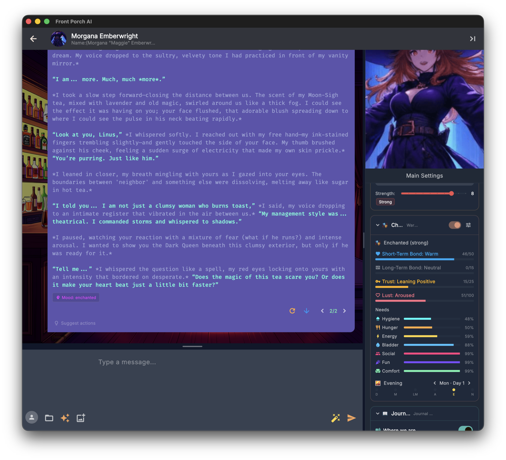
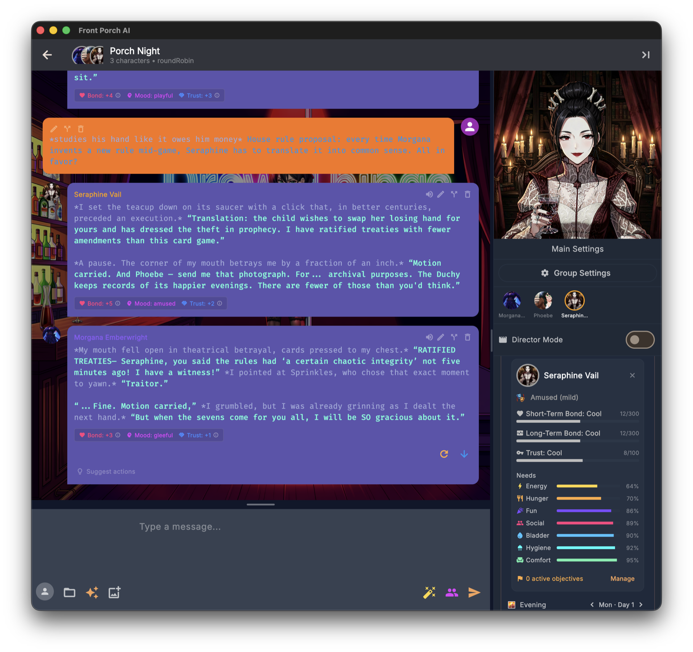

# The Realism Engine

The Realism Engine is Front Porch AI's signature feature — the system that turns a character from a clever text generator into someone who *remembers how they feel about you*. This guide walks through every part of it in plain language: what it tracks, what you'll see on screen, and how to tune it.

---

## Table of Contents

1. [What Is the Realism Engine?](#what-is-the-realism-engine)
2. [Turning It On](#turning-it-on)
3. [What You Will See](#what-you-will-see)
4. [Bond: How They Feel About You](#bond-how-they-feel-about-you)
5. [Trust: How Safe You Seem](#trust-how-safe-you-seem)
6. [Emotions That Linger](#emotions-that-linger)
7. [Desire and Intimacy Pacing](#desire-and-intimacy-pacing)
8. [The Passage of Time](#the-passage-of-time)
9. [Weather, Dreams, and Coming Back](#weather-dreams-and-coming-back)
10. [Objectives: Goals of Their Own](#objectives-goals-of-their-own)
11. [Fixations: Thoughts That Won't Let Go](#fixations-thoughts-that-wont-let-go)
12. [Growth Rings: How Characters Change](#growth-rings-how-characters-change)
13. [Chaos Mode (Chance Time)](#chaos-mode-chance-time)
14. [The Needs Simulation](#the-needs-simulation)
15. [Expressions: Seeing the Mood](#expressions-seeing-the-mood)
16. [Group Chats](#group-chats)
17. [The Director (Optional Quality Check)](#the-director-optional-quality-check)
18. [Speed, Cost, and Tuning](#speed-cost-and-tuning)
19. [When Things Look Weird](#when-things-look-weird)

---

## What Is the Realism Engine?

Without the Realism Engine, every message you send is judged in isolation. A character can pour their heart out one turn and greet you like a stranger the next. Nothing deepens, nothing heals, no time passes.

With it on, the app quietly asks your AI model a few short follow-up questions after each exchange — things like *"Did that change how they feel about the user?"* and *"Are they still upset about earlier?"* — and keeps a running score of the relationship. Those scores are then woven back into the next reply, so the character's warmth, guardedness, mood, and sense of time all carry forward naturally.

What that feels like in practice:

- **Kindness compounds.** A genuinely sweet gesture can warm a character for dozens of turns. A betrayal can sour things for a long while.
- **Moods have weight.** Emotions drift and linger instead of snapping back to neutral after every message.
- **The world keeps time.** Minutes and hours pass inside the scene, mornings turn to evenings, days accumulate on a real calendar, and characters remember where they are and what they were doing.
- **Nothing overrides personality.** The Realism Engine colors *how* a character expresses themselves — a prickly character at maximum bond is still prickly, just softer around the edges with you.

The whole system is optional and **off by default**. When it's off, no extra evaluation calls run at all and chats behave like a traditional character AI.

---

## Turning It On

You can control the Realism Engine at three levels:

**1. In Settings (your default for new chats).** Open Settings → General and switch on **Enable Realism Mode**. That's the default for new conversations, and it reveals the sub-toggles that ride with it: NSFW Cooldown, Automatic Passage of Time, Story Weather (plus a °F/°C switch), Dreams, and the welcome-back recap options.

**2. On the character card.** The character creator and character editor both have a Realism Engine panel where you can set the opening state of a brand-new chat: starting short-term bond, long-term bond and trust, the opening emotion and its intensity, the time of day, the day number, and even the calendar date and clock time the story begins at. The same panel holds the optional features (NSFW Cooldown System, Chaos Mode, the Director) and the character's needs baselines. These settings only seed *new* conversations — existing chats keep the state they've already built up.

**3. In the chat itself.** In a one-on-one chat, the sidebar's **🎭 Character State** card has the master switch right in its header, and switching it on mid-conversation makes the engine read back through the conversation so it can catch up instead of starting cold. A group chat's header doesn't carry that switch — the group's master toggle is **Realism Engine for this group**, in **Group Settings → Realism**. Either way, the small **tune** icon in the Character State header opens a Simulation settings flyout with the per-chat sub-toggles: **Needs Simulation**, **Automatic Passage of Time**, **One-Shot Eval**, and **NSFW Enhancements**.

> **Tip:** Front Porch cards keep the card's authored opening seed on the first message (`first_mes`) — that greeting does **not** Read the Room. Unauthored alternate greetings (a missing / null overlay slot) still do, so the opening mood matches *that* greeting. An authored seed on an alt — including an empty `{}` inherit — skips Read the Room and uses the seed (mood, bond, trust, clock, needs, wardrobe). Swiping back to the first message restores the card defaults. Groups match 1:1.

---

## What You Will See

Three things change on screen when the Realism Engine is active:

- **Chips under replies.** When something meaningful shifts — bond up, trust down, a mood change, a time skip, a need moving — small chips appear under the character's message showing exactly what moved and by how much. Chips with a small ℹ️ carry the character's own one-line reason; hover to read it. Quiet turns produce few or no chips; that's by design.
- **The sidebar.** The chat sidebar is a stack of cards: **📝 Author's Note**, **🎭 Character State** (mood, the Short-Term Bond / Long-Term Bond / Trust / Lust bars, fixation, needs grid, the story clock and date, weather, ambitions), **📖 Journal & Memory**, **🎯 Objectives**, and **🎲 Story Tools** (Chaos Mode, lorebooks, places, and more).
- **A brief processing overlay.** After a reply, you may see a short "thinking" overlay while the engine runs its check-ins. There's a **Cancel Realism** button if you'd rather skip it — interrupting is always safe.

All of this reaches the web and phone UI too: the same chips, toggles, needs bars, story calendar, and growth timeline are there, laid out for a smaller screen. Chance Time is the one part that looks different — a phone can't drive the desktop spinning wheel, so the web UI shows a two-beat reveal card instead (**🎲 Reveal Fate**, then **Accept Your Fate 🎲**).

---

## Bond: How They Feel About You

Bond is the heart of the system, and it comes in two layers that move at very different speeds.

**Short-term bond** is the character's current feeling toward you, on a scale from **−300 to +300** with named tiers along the way — from *Vitriolic* at the bottom, through *Neutral*, up to *Devoted* at the top. Ordinary conversation nudges it a point or two at a time; only genuinely meaningful moments move it in big jumps. It also slowly drifts back toward neutral — one point every ten turns — so relationships never get permanently stuck at an extreme. You have to keep showing up.

**Long-term bond** uses the same −300 to +300 scale but grows much more slowly, from *sustained* patterns rather than single moments. Keep the short-term relationship warm for a long stretch and the long-term bond quietly climbs; keep hurting someone and it erodes. Once earned, it's sticky: a character with deep long-term attachment keeps an undercurrent of affection even during a short-term fight — which is exactly how real relationships weather bad days.

Both feed directly into how the character writes: how open they are, how much warmth or frost is in their voice, how far they'll let you in.

**The moments get remembered.** Whenever bond, long-term bond, or trust crosses into a *new named tier*, the app writes a line into the character's **"Our Story"** timeline (the second tab of the Journal, reachable from the sidebar's Journal & Memory card). Small score wobbles inside the same tier stay silent — this is the long-horizon story of the relationship, not a second set of chips.

---

## Trust: How Safe You Seem

Trust is deliberately separate from bond. Bond asks *"How do I feel about you?"* Trust asks *"How safe are you?"* — and you can absolutely have one without the other.

Trust runs from **−100 to +100** and moves conservatively. Only your behavior moves it; the character's own actions never do. At deeply negative trust a character questions every motive and keeps everything surface-level. Around zero, their natural personality does the talking. At high trust, the mask comes down: they share real feelings and real vulnerability — expressed the way *that* character would express it.

Trust is also judged by *that character's* standards. Lavish gifts and instant devotion earn real credit from someone who welcomes warmth, and can read as an angle being worked by someone wary or calculating — the same gesture, two honest verdicts.

**Trust repair.** If a single turn costs 20 points of trust or more, the engine arms a repair window and watches your very next message closely. A sincere, personality-appropriate attempt to make it right can win back a meaningful chunk of what was lost. A glib "sorry" usually gets the reception it deserves.

**Promises are tracked.** When realism and the Journal are both on, a small check after each turn notices commitments — up to three open ones per character at a time — and remembers who made them. Keeping a promise you made is worth **+12 trust and +6 bond**; breaking one costs **−22 trust and −10 bond** (enough to arm the repair window on its own). Promises the *character* makes move bond only, up or down, because the character's own conduct never moves their trust in you. Open promises quietly color the next reply, and each one lands in the Journal as a 🤝 entry.

---

## Emotions That Linger

Every active turn, the engine updates the character's emotional state — not a flat "happy" or "sad," but a nuanced feeling (*wistful*, *flustered*, *guarded*, *smoldering*...) with an intensity of **mild, moderate, or strong**, filtered through who the character is.

The key idea is **inertia**. The previous mood is handed to the model along with the scene, so it names the new emotion by moving *from* the old one rather than re-deciding from scratch. Small moments cause small drift. Big moments — a fight, a confession, an intimate scene — leave a mark that takes several turns to fade. Characters stop emotionally teleporting, and the conversation gains a believable emotional throughline.

The current mood shapes tone, body language, and word choice in the next reply, and it survives app restarts, swipes, and regenerations.

---

## Desire and Intimacy Pacing

For mature roleplay, the engine can track physical desire on a scale from **−100 to +100**. It runs both ways: positive is building want (*Noticed*, *Aroused*, *Overwhelming*, *Feverish*), and negative is genuine aversion (*Distant*, *Rejected*, *Repelled*), because a soured mood or an unwanted advance is a real state a body can be in. This shapes how the character's body reacts and whether they would — or very much wouldn't — escalate. The **Lust** bar in the sidebar shows where they are.

**NSFW Cooldown** is the sub-feature that makes intimate scenes end the way real ones do. When the engine notices the character has reached a peak, desire resets to neutral — sated, not repelled — and a recovery window opens for **three to seven turns**, judged from the scene and the character. During recovery the character is written as genuinely spent: oversensitive, wanting closeness rather than another round, settling back to normal in phases, with desire swings damped so nothing can drag them into aversion just because they finished. The sidebar shows the turns remaining under the Lust bar.

None of the mechanics ever appear in the chat itself — no numbers, no "cooldown" talk. The character just behaves like a person. Turn it on per character in the editor (**NSFW Cooldown System**), globally in Settings (**NSFW Cooldown**), or per chat from the Character State gear (**NSFW Enhancements**).

---

## The Passage of Time

With **Automatic Passage of Time** on, the story runs on a real clock and a real calendar.

- **Time moves every single turn.** After each exchange the engine asks how long that exchange actually took and advances the clock by that much — a glance across a room might be two minutes, a long drive a couple of hours. A single turn can never move the clock more than **three hours**; bigger jumps are what new days and out-of-character skips are for.
- **It can never freeze and it can never run away.** If the model fumbles the question, the clock drifts a deterministic five minutes instead of stalling. If it somehow hasn't moved for twelve turns, the app snaps the scene to the next period on its own.
- **Six periods, real dates.** Dawn, morning, late morning, afternoon, evening, and night follow the actual hour. Rolling past midnight advances the day, and the sidebar shows both halves of the picture: *Morning · 9:00 AM* on the left, *Wed, Mar 3 · Day 3* on the right. Sleeping and waking in the story can also start a new day — but only when the scene really says so, so a model can't invent a sunrise out of nowhere.

**You stay in control:**

- Type an out-of-character note like `(OOC: we drive for several hours)` and the clock jumps immediately, with a small time-skip chip on the next reply.
- Use the **‹ ›** chevrons next to the date in the sidebar to nudge the scene back or forward one period by hand.
- Tap the date itself to open the **Story Calendar** — a month grid where you can set the current story date and time, see when the story began, and tap any marked day to read what the character remembers from it.
- Set the story's opening date and clock time on the character card, so a period piece starts in 1887 instead of today.

Even with the clock switched off, the engine keeps light track of *where* everyone is — sitting on the windowsill, standing in the rain — so characters stay physically grounded between turns instead of teleporting around the scene.

---

## Weather, Dreams, and Coming Back

Three smaller sub-features ride along with realism and make the passing days feel inhabited. All three are switched on or off in Settings, under the Realism block.

**Story Weather.** Each chat gets its own weather, worked out from the story's date rather than stored anywhere — which means it's identical every time you open the chat, on every device. Fronts roll through over several days instead of flickering: roughly half the time a day simply keeps yesterday's sky, otherwise it draws fresh from the season. It needs Automatic Passage of Time to be on. The sidebar shows a chip with the current condition and a real temperature (°C or °F, your choice), and hovering it tells you today's condition and season plus tomorrow's — so a character can genuinely say *"looks like rain tomorrow."* When tomorrow's sky is different from today's, the chip also shows a small **→** and tomorrow's icon right on it, which is how you see a change coming on a phone, where there's nothing to hover. Weather also nudges the Needs Simulation a little: rough weather wears comfort down faster, a clear day makes boredom set in more slowly. Characters always *experience* weather in words, never numbers.

If the chat has a **World** attached, that world's climate replaces the ordinary seasons — including custom condition names and emoji, wider temperature bands than Earth's, and place traits like thin, unbreathable, or outright hostile air and low, high, or near-zero gravity. Characters are told to behave accordingly: airlocks become rituals, heavy gravity makes every limb tired, time outside gets rationed. Worlds and their climates are covered in the [User Guide](user-guide.md).

**Dreams.** When the story crosses a night, the character dreams. The dream is short, hazy, first-person, and built *only* from what the Journal already says mattered to them — plus their fixation, the mood they went to sleep in, the weather outside, and any long-held ambition. It appears in the chat as a 🌙 banner before the morning's first exchange. Dreams need the Journal and Automatic Passage of Time to be on.

**Coming back after a break.** If you've been away longer than your chosen threshold (12 hours, a day, three days, or a week), opening the chat can show a small "where we left off" banner. A second, separate toggle — off by default — lets the character briefly acknowledge the gap in-story ("it's been a few days"), once, in vague terms, never guessing what you were doing. Both use the timestamp already saved with your chat; nothing new is collected and nothing leaves your device.

---

## Objectives: Goals of Their Own

Characters can have objectives — ongoing goals that give them a life beyond reacting to you.

- **Autonomous objectives.** Every so often, when the story genuinely supports it, the character will adopt a personal goal on their own ("find out who sent that letter"). The engine then breaks it into concrete, sequential tasks automatically — **five** if it becomes their main quest, **three** if it's a side goal — and quietly checks progress as the story unfolds. When every task is done, the quest retires itself and the main-quest slot frees up for the next one.
- **Your objectives.** You can also type in an objective yourself from the sidebar's **🎯 Objectives** card (or, in a group, from the group objectives dialog). Objectives you create deliberately do *not* auto-generate tasks — you stay in control — but there's a **Generate Tasks** button whenever you want them, with a dropdown for how many (3 to 10, default 5).

Most turns produce no new objective at all. That's intentional: goals should feel like story beats, not spam.

### Ambitions

Ambitions are the long horizon: what a character is ultimately working toward, as opposed to the objective they're pursuing this week. You write them on the character card, one per line ("Open my own bakery"), and they show up in the sidebar with a 🧭 and a stage word — *just beginning*, *gaining ground*, *halfway there*, *nearly there*, *achieved*.

Progress only moves when a quest that genuinely served the ambition completes, so it advances at the pace of the story rather than the pace of the chat. Passing the quarter, half, and three-quarter marks writes a milestone into "Our Story", and actually reaching an ambition plants a Growth Ring — because arriving somewhere you spent a whole story reaching for changes who you are. Ambitions never appear as numbers in the fiction, only as words.

---

## Fixations: Thoughts That Won't Let Go

Sometimes something lands hard enough that a character can't stop thinking about it — a worry, a hope, a memory, something you said three scenes ago. The engine calls these **fixations**.

When one takes hold, it subtly colors the character's responses for the next **3 turns**: a stray thought here, a loaded pause there, the topic resurfacing if the conversation drifts near it. It never hijacks the scene — it just gives the character a believable inner life that keeps running between moments. The active fixation is visible in the sidebar, and fixations fade naturally on their own.

---

## Growth Rings: How Characters Change

Over a long story, people change. **Growth Rings** let your characters do the same — and the name is the point. A ring is a small, evidence-backed sentence layered *on top of* the character, like a tree adding a season's growth. Your original character card is never rewritten, and rings belong to one chat only: another conversation with the same character is untouched, and deleting the chat deletes the rings with it.

**How it works.** Growth is **off by default**. Switch it on from the **Growth** panel inside the sidebar's 📖 Journal & Memory card. From then on, every few of your messages (a slider sets the pace, from every 2 to every 20; the default is 5) the engine looks at what has happened and proposes small changes — a new stance, a habit, a skill, a scar.

**Rings get stronger, or they fade.** A new ring starts out **emerging**. Reinforce it by living it in the story and it becomes **developing**, then **established** — and an established ring is permanent: it never fades and never gets retired automatically. A ring nobody reinforces loses a little strength each check and, once it reaches zero, quietly steps aside into *Past growth* — which is exactly what happens to a phase someone was going through. A character keeps up to twelve active rings; adding a thirteenth moves the weakest ring that isn't pinned or established into *Past growth* the same way. Nothing is ever deleted behind your back: a retired ring stays readable in the collapsible **Past growth** list at the bottom of the timeline.

**You are never locked out.** In the Growth panel you can read the whole timeline grouped by tier, pin a ring so it can never fade, edit its wording, plant one by hand, retire one, run a check immediately, or reset the character's growth entirely. Many rings carry a receipt — tap it to jump straight to the message in the chat that caused it. Not every ring has one: a ring you plant by hand has no receipt, because you're the source, and planted rings also arrive pinned, so they never fade.

**Want a veto?** The Growth panel's gear has **Review growth before it applies**. It's off by default (characters grow on their own); turn it on and proposed rings wait in a review list with checkboxes until you approve them.

Growth is a separate toggle from the main Realism switch, but the two together are where the "living character" feeling really comes from.

> Growth Rings replaced the older whole-personality rewrite system, and the "scenario evolution" that came with it was retired at the same time — the Journal's *"Where we are"* recap now carries where the story stands. If a character has growth recorded under the old system, the panel says so and converts it into rings at the next check.

---

## Chaos Mode (Chance Time)

Chaos Mode is the drama engine — for when you want the story to surprise *you*.

While it's on, pressure builds behind the scenes. Every turn the gauge climbs 5 points and the app rolls against *pressure + 5*, so an event is possible from the first turn and certain by the nineteenth. When it triggers, a full spinning-wheel overlay takes over the screen with eight possible fates, you spin, and the scene gets an event the character *must* react to — there's no dismissing it, only **Accept Your Fate 🎲**.

The pool holds **over 150 events** in five flavors — 🟢 fortune, 🔴 misfortune, 💛 chaos, 💜 wild cards, and 🎪 pure slapstick. An **Include spicy events** 🌶️ toggle adds another 30 for 18+ chats. Events are written as natural story beats (a stranger pays for the character's meal; a very personal delivery arrives at the worst moment), and the character reacts to them in-fiction without ever mentioning the game mechanics.

A few practical notes:

- Chaos Mode lives in the sidebar's **🎲 Story Tools** card, which shows the current pressure and a **SPIN NOW** button for triggering the wheel on demand.
- A triggered event survives regenerates and swipes — no rerolling your way out of it. It clears when you send your next message.
- Pressure resets to zero after each event fires.

---

## The Needs Simulation

The Needs Simulation is an optional layer on top of the Realism Engine that gives characters a body and a daily rhythm, in the spirit of classic life-sim games. It's off by default; switch it on per character in the editor or per chat from the Character State gear. Each character tracks **seven needs**, each on a 0–100 scale:

| Need | When it runs low... |
|---|---|
| **Hunger** | Stomach growls; they'll want to eat, and eventually can't ignore it |
| **Bladder** | Increasingly distracted; will excuse themselves if you don't |
| **Energy** | Yawning, flagging, genuinely exhausted |
| **Social** | Craves real connection and attention |
| **Fun** | Restless and bored; wants stimulation, mischief, *anything* |
| **Hygiene** | Feels grimy; wants to freshen up |
| **Comfort** | Physically uncomfortable; wants to shift, stretch, or relocate |

**How it plays out.** Every turn drains each need a little. Below **35** a need becomes urgent and starts shading the character's behavior; below **20** it's critical and they will act on it. Let hunger, energy, bladder, hygiene, or comfort hit rock bottom and you get a genuine story consequence — a character who hasn't eaten in far too long doesn't just mention it, they hit a wall — after which that need recovers partway, the way a body does. Needs also interact: a deeply bored character finds company less soothing, exhaustion makes hunger bite harder, and nobody's comfortable with a desperately full bladder.

**The scene feeds the simulation.** What actually happens in the story is what moves the numbers. A meal restores hunger. A bath restores hygiene. A nap restores energy. Laughter, affection, and adventure top up fun and social. An intimate scene ripples through several at once — energy and hygiene down, fun and social up.

**What you'll see.** Chips under each reply show which needs moved and *why* ("Scene action," "Natural decay," or the model's own short reason) — needs that didn't change stay out of the way. The sidebar shows live bars for every need, and in group chats each member's card shows their own.

**Making it yours.**

- Each need's starting value and its decay rate per turn can be tuned per character in the editor, along with a **Needs delta strength** dial (1×–5×) if you want gentler or much more dramatic swings from the same scenes.
- There's an option for characters who canonically *enjoy* being a mess — low hygiene reads as contentment for them instead of distress.
- If a reply's needs chips look plainly wrong, the last message carries a **Manual Reprocess** pill: type what the model got wrong, and it re-scores that turn. A **Revert** pill puts the old numbers back.
- The numbers never appear in the story itself. The character just gets hungry like a person, not like a video game.

---

## Expressions: Seeing the Mood

If you use Character Expressions (emotion-driven portraits), the Realism Engine feeds them directly: the nuanced mood it tracks is matched to your character's expression images, so the portrait genuinely reflects how they feel.

The app uses **30 emotion labels** — the standard 28-label set that expression packs are built around, plus *affection* and *anticipation*. That means an ordinary sprite pack works: open the character's avatar gallery and use **Import ZIP sprite pack**, and any image whose file name is one of those labels — either on its own or followed by `-`, `.`, or `_` and whatever else you like (`joy.png`, `anger-1.png`, `sadness_2.png`, in folders or not) — is filed automatically. The label has to be the real one, so `sadness_2.png` lands and `sad_2.png` doesn't. Anything it doesn't recognize is skipped and counted so you know. See the [User Guide](user-guide.md) for setting up expression images.

---

## Group Chats

Everything above works in group chats, per character. Each member keeps their **own** bond, trust, mood, desire, fixations, objectives, growth rings, and needs — warm up to one character while another still doesn't trust you, and both will act like it. The character currently speaking is the one whose state shapes the reply and gets updated afterward, which keeps things fast no matter the group size. Time and weather, by contrast, are shared: it's one scene.

A few group-specific notes:

- **The master switch lives somewhere else.** A group's 🎭 Character State header shows only the tune icon — no on/off switch. The group's master toggle is **Realism Engine for this group**, on the **Realism** tab of Group Settings. The tune icon and its per-chat sub-toggles work the same as in a one-on-one.
- Chips always belong to the character who spoke. The sidebar shows whoever is *focused* — tap a face in the row of avatars at the top of the sidebar to switch. (Tapping a member's card in the sidebar is different: that picks who speaks next.)
- **Group members also track how they feel about each other**, not just about you — hidden dynamics that color how they speak to one another. This runs in groups of **four or fewer**; above that the app keeps everyone's feelings toward *you* fully simulated but drops the cross-member web, which would otherwise balloon the prompt.
- **Director Mode is the exception.** When you're directing scenes rather than living in them, realism and needs tracking pause (state is preserved and resumes when you switch back). Directing is storyboarding; regular group chat is the lived-in simulation.

The engine's behavior in a group is deliberately identical to a one-on-one chat — a character should feel like the same person whether you're alone with them or not.

---

## The Director (Optional Quality Check)

Smaller local models occasionally produce sloppy realism updates — numbers that don't match the scene you just read. **The Director** is an optional, per-character quality check that reviews each realism and needs update against the actual scene before it's applied, and sends obviously-wrong ones back for another pass.

- Turn it on in the character editor under Optional Features, as **Realism Verification (Director/Verifier)** — it's **off by default** and costs nothing while off. Two sliders control how many correction passes it may attempt (1–5) and how strict it is (1–5).
- While it works you'll see *"🕵️ Verifying Realism output"* in the processing overlay, and afterwards a small chip on the reply: **"✓ Director accepted"** or **"🕵️ Director corrected"** — so you always know when the numbers you're seeing were double-checked.
- It does add extra evaluation calls, so it's best on a fast backend or a strong model. If your realism numbers already look sensible, you don't need it.

---

## Speed, Cost, and Tuning

The engine's check-ins are small and quick compared to the main reply, but they're real work — here's how to keep things snappy:

- **One-Shot Eval** (in the Character State gear) folds four separate check-ins into a single combined call. It tracks the same things with noticeably less waiting — the go-to choice on slower machines and pay-per-token remote APIs. Very small models occasionally handle the combined question less gracefully than the separate ones; if your results get flaky, switch it back off.
- **Cancel anytime.** The processing overlay has a **Cancel Realism** button, and interrupting an evaluation never corrupts anything.
- **Toggle per chat.** Want a quick, lightweight conversation? Flip the Character State switch off in that chat — or, in a group, **Realism Engine for this group** in Group Settings → Realism — and realism costs nothing at all.
- **Tool calling helps.** A pill at the top of the sidebar reports whether the current model can answer the engine's questions with native tool calls. When it can, the answers come back cleanly structured; when it can't, the app falls back to plain text — which still works, just a little less reliably. It retests itself when you switch models or backends, and you can tap it to retest now.
- The engine's notes to the model add only a few hundred tokens and are always counted inside your context budget — they will never push your conversation history out of the window.

---

## When Things Look Weird

A few quick answers to the most common head-scratchers:

- **Bond and trust barely move.** That's usually correct behavior — ordinary chatting is *supposed* to produce small or zero changes. If nothing ever moves, check that realism is actually on for that chat — the Character State switch in a one-on-one, **Realism Engine for this group** in Group Settings → Realism in a group — and consider a stronger model: very small models sometimes ignore the check-in questions.
- **Evaluations come back empty.** A known quirk of some local models. Check the tool-calling pill at the top of the sidebar — a model that supports tool calls returns much cleaner results. If yours doesn't and you see empty evals often, a different model usually fixes it. More in [Troubleshooting](troubleshooting.md).
- **Time is moving too fast or too slow.** The clock follows what the model says each exchange took, capped at three hours a turn. If a scene is dragging, an `(OOC: ...)` skip or the ‹ › chevrons will move it; if it's racing, the Story Calendar lets you set the date and time back to exactly where you want them.
- **You want a clean slate.** Start a new chat with the character — the starting state on their card applies fresh, and the old chat keeps its own history.
- **Everything is slow.** Turn on One-Shot Eval, or switch realism off for that particular chat. Running several heavy things at once (a big model, TTS, image generation) compounds on modest hardware.

For deeper fixes, see [Troubleshooting](troubleshooting.md) or ask on [Discord](https://discord.gg/e4tET6rpdv) — I'm around, and so is a friendly community.

---

**One last thing.** The Realism Engine is the reason this app exists. Leave it on for a few long sessions with a character you like — the difference between "talking at an AI" and "having a relationship that grows, breaks, heals, and changes" is honestly night and day.
